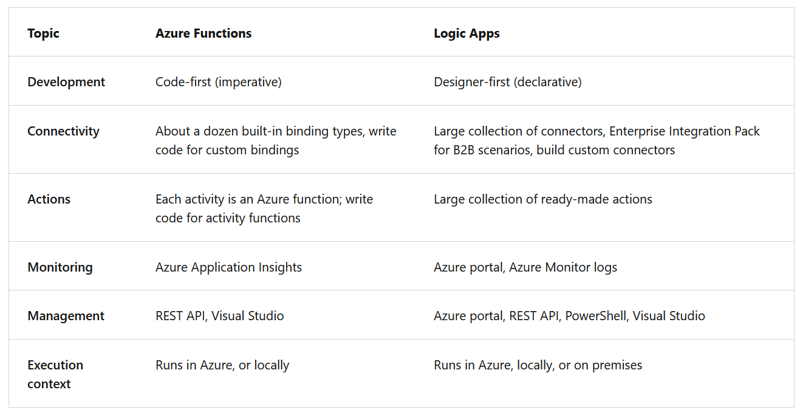
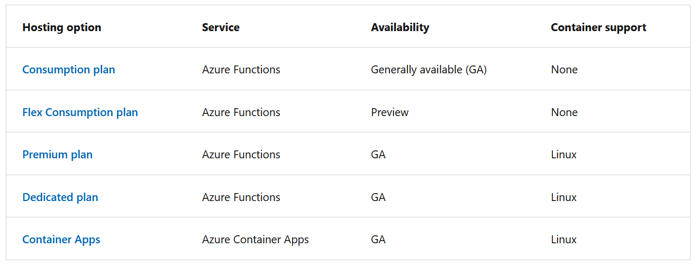
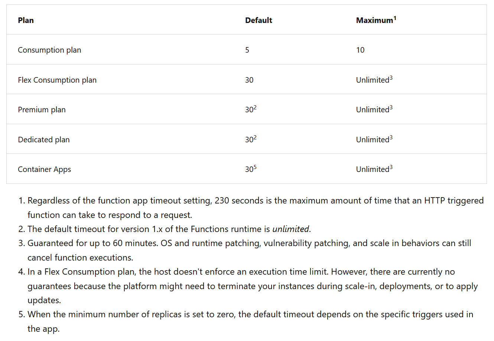

# Azure Developer Associate AZ-204

## Tips

- **WGU Test Chatter**
  - **Spencer G**: understand how triggers/bindings work and how Event driven processes work.
    - flashcards posted here, and munoz_notes.
  - [cyber vista practice exams](https://app.pluralsight.com/paths/certificate/developing-solutions-for-microsoft-azure-az-204)
- **Reddit**
  - <https://www.reddit.com/r/AzureCertification/comments/1difpww/az204/>
- **Study Guides**
  - [Thomas Maurer](https://www.thomasmaurer.ch/2020/03/az-204-study-guide-developing-solutions-for-microsoft-azure/)
  - [Github AndreaKarz](https://github.com/AndreasKarz/AZ-204)
  - [Github Argigeaus](https://github.com/arvigeus/az-204)
  - [Wolfgang](https://programmingwithwolfgang.com/mastering-az-204-exam-comprehensive-guide-azure-certification-preparation)
- **Testing Notes**
  - heavy on container and function services.
- **Microsoft Learn**
  - [learn microsoft](https://learn.microsoft.com/en-us/credentials/certifications/azure-developer/?practice-assessment-type=certification)
  - [az-204 study guide](https://learn.microsoft.com/en-us/credentials/certifications/resources/study-guides/az-204)
  - [azure cli](https://learn.microsoft.com/en-us/cli/azure/reference-index?view=azure-cli-latest)
  - [exam demo](https://www.starttest.com/ITDVersions/22.0.0.0/ITDStart.aspx?SVC=3fb29b00-3364-4988-ab97-06acfc734207)
  - [az-204 labs](https://microsoftlearning.github.io/AZ-204-DevelopingSolutionsforMicrosoftAzure/)
  - [landing zone best practices](https://learn.microsoft.com/en-us/azure/cloud-adoption-framework/ready/landing-zone/design-areas)
- **Practice Exams**
  - <https://wgu.udemy.com/course/az204-azure-practice/>

## App Services

- **App Service**
  - **App Service**: PaaS. HTTP-based service for hosting, develop and deploying web, mobile, and API apps.
  - has third party **identity providers**(Facebook, Google, Microsoft) **integration** for managing **customer authentication**.
  - defines a set of **compute resources**(how many VMs, compute, disk for each VM) for a web application to run on.
  - configuration settings include runtime stack(node, python, dotnet...), operating system(linux, windows), region and App Service plan(standard, premium, isolated...).
  - brings together everything you need to create websites, mobile backends, and web APIs for any platform or device.
  - **containers**: run container apps on windows or linux. pull images from Azure Container Registry or Docker Hub.
  - **Load Balancer**: optional. layer 7, round robin, deliver HTTP request to **workers**(web servers).
- **App Service Autoscaling and Automatic Scaling**
  - **Scaling**: vertical(more compute, up/down) or horizontal(more VMs, out/in).
  - **elasticity for your services**, responding to changes in the environment by **adding or removing web servers and balancing the load** between them.
  - **availability and fault tolerance**: avoids long wait times to response because not enough resources.
  - true autoscale you provide max and min.
  - **resource-intensive processing**: autoscaling might not be an effective approach. increase Vertical scaling.
  - **scope**: instance limit is set by App Service Plan pricing tier. Autoscaling cannot scale beyond instance limit.
  - **Automatic Scaling**
    - new scale-out option. pre-warms resource for smooth transition.
  - **AutoScale Rule**
    - description of **when** and **what** action to perform.
    - monitor from **_Run history_** tab. **Activity Log** alert can be set for success or failure of autoscaling.
    - rules threshold is for **all** instances running. e.g. CPU > 80%, all instances CPU must be > 80%.
    - scale based on **metric**: disk queue or HTTP request awaiting processing.
    - scale according to predefined schedule.
    - **time grain**: length of time between Service metric updates.
    - **time aggregation**: grouping of time grain values. Avg, Min, Max, Sum, Last, Count.
      - **duration**: amount of **time grain** to group for a better picture of resource usage over time.
    - **Actions**: scale-out/in. define rules in pairs: when to scale-out and when to scale-in.
      - **cool down**: during this time, will not scale in/out.
    - **Autoscale condition**: group of autoscale rules. scale-out if **any** rules met. scale-in if **all** rules met.
    - **Best Practices**
      - **DoS attack**: implement **detection** and **filtering** of requests **before they reach your service**.
      - min/max numbers are **inclusive**, so scale-in/out rules must not use same numbers.
      - choose best diagnostic metric: Avg, Min, Max, Total.
      - when scale-out adds instance, the Avg will divide metric by one more, dropping the result. if result falls within scale-in, you will create a **flapping** effect. To avoid this, it will **not** scale-in. solve this by choosing adequate margin between scale-in/out.
      - **default instance count** should be the min needed if metrics are unavailable.
      - configure autoscale notifications.
- **App Service Plan**
  - App Service always runs in App Service Plan. defines compute resources for a web app to run. one or more apps can run on the same compute resource.
  - **scope**: VM apps created in same region as App Service Plan defines.
  - **Scaling**
    - **scale unit**: **changing plan tier** is the only way to **increase scale-out**.
    - changing scale size by changing plan tier.
    - **Isolate apps by adding to separate App Service Plan**:
      - The app is resource-intensive.
      - You want to scale the app independently from the other apps in the existing plan.
      - The app needs resource in a different geographical region.
  - **Shared**: **Free** or **Shared**, two base tiers. charged **per CPU minute**.
    - allocate CPU quotas to each app that runs on the shared resources
    - **linux cannot run on shared**.
    - **resources can't scale out**.
    - **only for development and testing**.
  - **Dedicated**: **Basic, Standard, Premium, PremiumV2, PremiumV3**.
    - only apps in App Service Plan share compute resources.
    - **higher tiers have more VM instances** available for scale-out.
  - **Isolated**: **Isolated, IsolatedV2**.
    - dedicated VMs on dedicated VNet.
    - network and compute isolation.
    - maximum scale-out.
- **App Service Authentication and Authorization**
  - **App Service** feature that provides out-of-the-box authentication with federated identity providers, allowing you to focus on the rest of your application.
  - Security Module: authenticate users, manage tokens, sessions, and inject identity into request headers.
  - built-in authentication and authorization support.
  - configured by using App settings, when enabled, every HTTP request will pass through the security module before it's handled by your App.
  - automatic logging of authentication and authorization traces.
  - **Settings**
    - **Allow Anonymous(unauthenticated) Request**: defer authorization of unauthenticated traffic to your App.
    - **require authenticated**: **_all_** anonymous traffic is sent to login provider page. Even home page.
  - **Logging**
    - enable auth traces to be written to log files.
- **App Service Environment (ASE)**
  - **fully isolated and dedicated environment** for securely running App Service apps at high scale.
  - gated by WAFs. **External/Internal load balanced**.
  - can create multiple ASEs across regions or single region.
- **App Service Setup**
  - **OS**: windows, linux
  - **Region**: location of datacenter. e.g. 'East US'.
  - **Number of VM instances**: how many VM instances allocated to plan.
  - **Size of VM instances**: compute. (Small, Medium, Large).
  - **Pricing Tier**: **Free, Shared, Basic, Standard, Premium, PremiumV2, PremiumV3, Isolated, IsolatedV2**.
  - **Configuration**
    - General settings: configure stack, platform, debugging, and incoming client certificate.
    - Application settings:
    - Path mappings: incoming URL redirects.
- **App Service Variables**
  - **Portal**: `App Settings/Environment Variables`
  - **CLI**: `az webapp config appsettings set --settings key1=value1 key2=value2 --name ...`
- **Application Insights**
  - continuously monitor the performance and usability of your apps.
  - analytic tools(failure, response, request, views, load performance) to understand what users are doing with your apps.
  - Apps hosted on-premises, in a hybrid environment, or in any public cloud.
  - 
- **Backup and Restore App**
  - App snapshots can be created on a schedule or manually backup.
  - **Standard** or **Premium** tier App Service plan.
  - full or partial backups.
- **Continuous Integration and Deployment CI/CD**
  - **automated deployment**: automate the testing and deployment of code changes.
  - automated deployment. push new features and bug fixes in a fast, repetitive pattern.
  - **Automated**
  - **Azure DevOps**: pipeline. code changes -> testing -> deploy. build, test, run in cloud. Push to web app.
    - **GitHub**: connect to Azure. changes to repo, deployed to web app.
    - **Bitbucket**: same as GitHub.
  - **Manual**
    - Git(link web app to Git URL), CLI(`az webapp up`), Zip deploy(`curl http...`), FTP(S).
- **Deployment Slots**
  - with App Service, instead of deploying to production node, you deploy to another node with **it's own hostname**.
  - **scope**: Standard, Premium, Isolated. each progressive tier has higher slot count.
  - manage different app stages(development, testing, staging, and production).
  - similar to **_blue/green_** deployment strategy. Rollback if "**_swap_**" is not as expected.
  - new deployment slots can be empty or cloned.
  - **swap**: loads and starts image(**warm up**), if **HTTP responds**, considered **warmed up** and **switches routing rules** from **source** to **target** slot.
    - the HTTP request and URL path can be altered.
  - **swap with preview**: load and starts slot image, pauses to allow you to preview, before switching routing rules to target slot.
  - **auto swap**: when code changes, automatically swaps app into production. not on linux or Web App for Containers.
  - **Swap Routing**
    - **Traffic Percentage**: you can change percentage of traffic to another slot.
    - **Manual Routing**
      - link back to production from beta: `<a href="<webappname>.azurewebsites.net/?x-ms-routing-name=self">Go back to production app</a>`
      - address to go to beta: `<webappname>.azurewebsites.net/?x-ms-routing-name=staging`
      - default routing is `0%`(light grey color) setting the percentage manually to `0%`(black color), allows you to hide traffic while allowing internal team to reach resource.
  - 
- **Domain Names (DNS) Records**
  - you are given a sub domain name for main account owner: `yourAppName.azurewebsites.net`.
  - purchase domain from Azure portal, you don't have to configure anything.
  - `A` record: map domain name to IP address of web server.
  - `Cname`: maps domain name to another domain name.
- **Logging**
  - enable persistent storage, enable logging.
  - logs can be stored in **Azure Storage** or **App Service file system**.
  - **Linux**: only supports **Deployment logging**.
  - **Level of information**: disabled, error, warning, information, verbose.
  - **Streaming**
    - enabled from `Portal/App Service/yourApp/Log stream` or CLI `az webapp log tail --name appName --resource-group groupName`
    - files ending in `.txt, .log, .htm` stored in the `d:/home/logfiles` are streamed by App Service.
- **Network**
  - default App Service apps are accessible through internet endpoints only.
  - multitenant(Free, Shared) will have **many different customers** in the same App Service scale unit(VM), it would be a security risk to connect App Service directly to your VNet.
    - the solution is to handle web app communication: inbound and outbound.
    - `App-assigned Address` // Inbound
    - `Hybrid Connections` // Outbound
  - **front-ends**: handle all http(s) request.
  - **workers**: handle workload.
  - control **VNet inbound/outbound** traffic:
    - **multitenant**: Free - PremiumV3.
    - **single-tenant**: Isolated.
- **Path Mappings**
  - determine how web app handles incoming requests for a specific path or directories.
  - e.g. `www.example.com/images` would map to `media/images`
- **Security Certificates TLS/SSL**
  - upload or import public certificates into App Service.
  - certificate binds to **App Service plan resource group and region**(called **webspace**). makes certificate **accessible to other apps** in same resource group and region combination.
  - **scope**: all tiers except Free.
- **Storage**
  - containerized storage is ephemeral. persistent storage can be added to containerized apps.
- **WebJobs**
  - run script in the same instance as web app. no additional charge.

```powershell
# online Azure Cloud Shell
az webapp list-runtimes --os-type linux # show linux runtime options. node, dotnet, python...
```

## Functions

- **Azure Function as a Service (FaaS)**
  - serverless, event driven **triggers(based on event or emit data)** to start functions.
  - define input, actions, conditions, and output.
  - fully managed and scales to zero.
  - requires a **storage account to operate**.
  - **function app**: one or more individual functions that are managed, deployed, and scaled together.
    - share the same pricing plan, deployment method, and runtime version.
    - **Functions 2.x all functions** in a function app must be authored in the **same language**.
  - **Serverless**
    - fully managed cloud services. you bring the code.
    - abstracts infrastructure and are billed on execution time. do not pay for idle servers.
    - highly: scalable, elastic, available, durable, secure by default.
  - **Project Files**: root of directory.
    - `host.json`: metadata file configuration options on Azure Functions.
    - `local.settings.json`: local on-prem specific configurations to override `host.json`.
  - **orchestration**: collection of functions(steps).
  - **trigger**: start function.
  - **bindings**: simplify coding for input/output data.
    - **input bindings**: respond to event.
    - **output bindings**: listening for result of function.
  - 
- **Azure Function vs Logic Apps vs App service WebJobs**
  - all are serverless.
  - **Logic App**: serverless workflow integration(**actions**) executed to accomplish a task.
  - 
  - **WebJobs SDK**: Functions is built on WebJob SDK.
    - Azure Functions offers more developer productivity than Azure App Service WebJobs does.
    - offers more options for programming languages, development environments, Azure service integration, and pricing.
  - 
- **Function Hosting Plans**
  - **Consumption Plan**: default. pay-as-you-go w/automatic scale. dynamically added based on incoming events.
  - **Flex Consumption Plan**: same as consumption with better options: Compute and 'cold start' pre-provision(always ready) instances.
  - **Premium Plan**
    - always ready instances. better Compute.
    - functions that run continuously.
    - more control over instances(CPU, memory).
    - high number of small executions(low GB seconds for each run) or code needs longer run times.
    - require VNet connectivity. need custom linux image.
  - **Dedicated Plan**
    - same as Premium. runs at App Service rates. predictable billing.
    - manually scale instances.
    - full compute isolation. secure network access by ASE(App Service Environment).
    - high memory usage.
  - **Container Apps Plan**
    - functions run in container. Kubernetes style workflow without complexity.
    - create custom library to support **line-of-business** apps.
    - migrate on-prem code or legacy apps to cloud microservices running in containers.
  - 
  - **Function Timeout**: max time avaiable in minutes function has to return response.
  - 
  - **Functions Scale Instances**: max instances
  - 

```bash
# Create Trigger

```

## Azure CLI

```bash
# Logs
## Stream Logs

```
