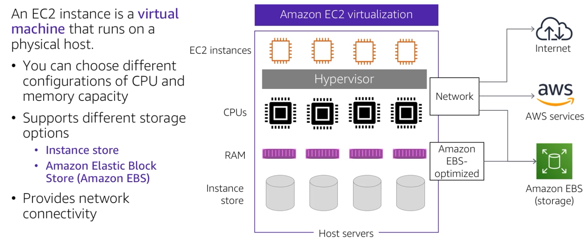
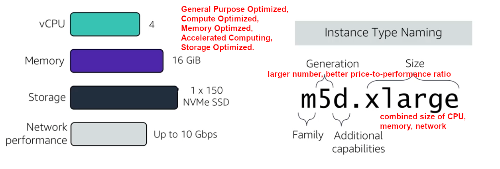
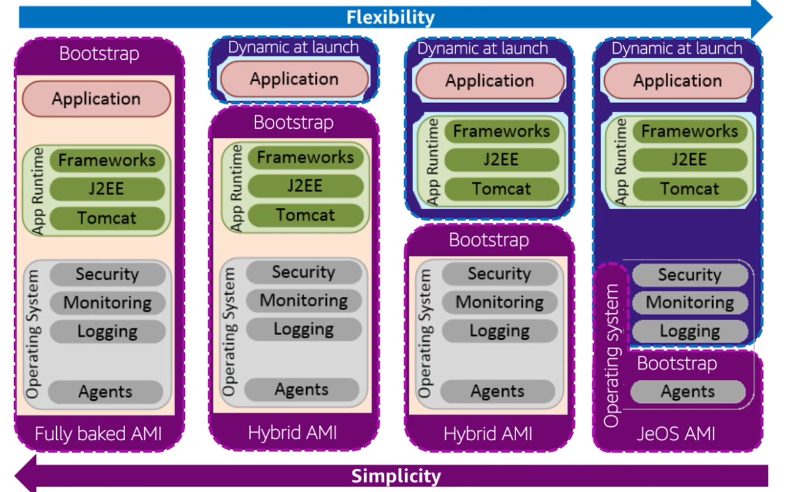
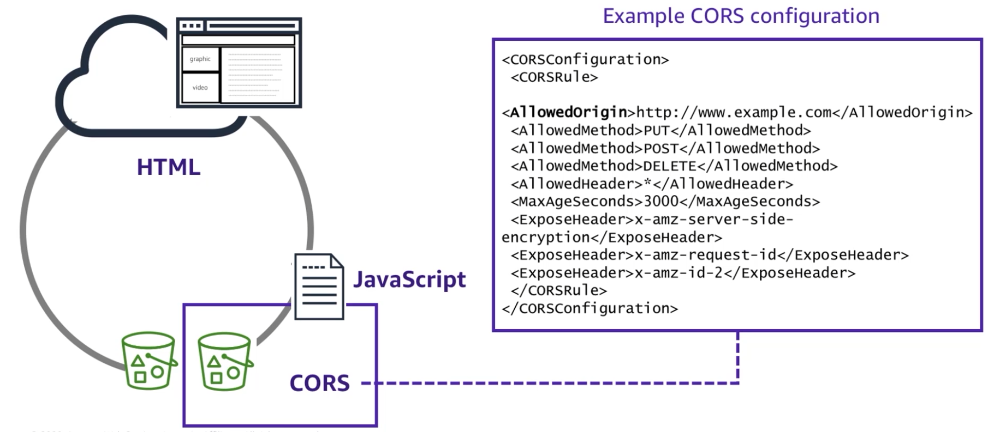

# AWS Solution Architect Associate (SAA-C03)

## Tips

- <https://www.freecodecamp.org/news/pass-the-aws-certified-solutions-architect-associate-certification/>
- **YouTube**
  - [FreeCodeCamp AWS exam tutorial (2020)](https://www.youtube.com/watch?v=Ia-UEYYR44s)
  - [FreeCodeCamp AWS exam tutorial (2024)](https://www.youtube.com/watch?v=c3Cn4xYfxJY)
    - <https://www.freecodecamp.org/news/pass-the-aws-certified-solutions-architect-associate-certification/>
- **WGU Chatter**
  - **Spencer G**: heavy focus on security so know your encryption types (at Rest, In Transit, Client\Server.) Know KMS and CloudHSM. Know your IAM policies and review policies in general. Also understand your Databases - Aurora, DynamoDB, RDBMS. Know your EFS, FSx, EBS, S3 + lifecycles. Try to look for keywords like "Serverless". Exam Dojo and Udemy can be used but I feel like they're harder than the OA since they involve connecting 2-3 services together while the OA is mainly just 1 service at a time but with more depth on that specific service. I used the Course Material Section review questions and Percipio Testprep as the bulk of study for my practice questions.
  - **JW M**: knowing S3 and its Lifecycle policies, what CloudHSM is, The different VPC Endpoints and what each one does, CloudFront, and how Aurora and NoSQL are DIFFERENT from other databases.
  - **Denise W**: heavy on encryption and the differences between Relational vs Non-relational databases.
  - [Udemy Practice Exams](https://wgu.udemy.com/course/practice-exams-aws-certified-solutions-architect-associate/)
- **AWS**
  - 100–1,000. The minimum passing score is 720.
  - [AWS Design Architecture](https://explore.skillbuilder.aws/learn/public/learning_plan/view/1044/solutions-architect-knowledge-badge-readiness-path)
  - [AWS Exam Prep](https://explore.skillbuilder.aws/learn/course/external/view/elearning/14760/exam-prep-standard-course-aws-certified-solutions-architect-associate-saa-c03)
  - [AWS Exam Practice Questions](https://explore.skillbuilder.aws/learn/course/internal/view/elearning/13266/aws-certified-solutions-architect-associate-official-practice-question-set-saa-c03-english)

## Table of Contents

1. <a href="#AWS-Bash-CLI-Login">AWS Bash CLI Login</a>
2. <a href="#AWS-Well-Architected-Framework-Six-Pillars">AWS Well-Architected Framework (Six Pillars)</a>
3. <a href="#Best-Practices">Best Practices</a>
4. <a href="#Authentication-and-Authorization">Authentication and Authorization</a>
5. <a href="#Compute">Compute</a>
6. <a href="#Network">Network</a>
7. <a href="#S3">S3</a>

## AWS Bash CLI Login

- **Install**
  - <https://docs.aws.amazon.com/cli/latest/userguide/getting-started-install.html>
  - `aws --version` // check if installed correctly.
- **Create AWS User**
  - <https://docs.aws.amazon.com/streams/latest/dev/setting-up.html>
  - create new user. assign to IAM group with admin privileges.
  - create access keys. copy access key and secret key.
- **Login**
  - <https://medium.com/@nickjabs/installing-and-configuring-the-aws-cli-on-windows-with-wsl2-72f2b72d21bc>

```sh
# login -get access and secret key from IAM portal.
aws configure # copy paste access and secret key.

# check your logged in.
aws sts get-caller-identity
```

## AWS Well-Architected Framework (Six Pillars)

- <https://docs.aws.amazon.com/wellarchitected/latest/framework/the-pillars-of-the-framework.html>
- **Operational excellence**
  - run and monitor(logging) systems. fix quickly and safely.
  - IaC reduces mistakes and increases reliability.
- **Security**
  - protect at all layers(data, systems, assets).
  - enable traceability(log of all changes and access).
  - risk assessment and mitigation strategies.
- **Reliability**
  - recover from infrastructure or service disruption.
  - dynamic recovery, scale, mitigation.
- **Performance efficiency**
  - most efficient resource selection as demand changes.
  - democratize: use ready made solutions for advanced problems.
  - mechanical sympathy: understand best way to take advantage of services, resources.
- **Cost optimization**
  - measure efficiency. eliminate unneeded expense. reduce employee overhead with managed services.
  -
- **Sustainability**

## Best Practices

- **Enable Scalability**
  - dynamic scale based on load. increase availability.
- **Automate your environment**
  - dynamic increase/decrease infrastructure.
  - automate monitoring/notifying when resources change.
- **Treat resources as disposable**
  - Infrastructure as Code (IaC). declarative control infrastructure.
  - terminate resources not in use.
- **Use loosely-coupled components**
  - avoid tightly-coupled resources.
  - 
- **Design services, not servers**
  - use AWS services to connect your infrastructure.
  - containers(docker), ephemeral(IaC), Queues handle communication between applications.
  - static assets stored in S3.
- **Choose the right database solutions**
  - acceptable latency, max concurrent users, data integrity.
- **Avoid single points of failure**
  - create secondary systems to avoid single point failure.
  - 
- **Optimize for cost**
  - CapEx: capital expense. One-time investments in long-term assets. (e.g. hardware servers)
  - OpEx: operational expense. Ongoing costs associated with running the project. (e.g. software license, pay-as-you-go).
- **Use Caching**
  - request are faster, increase data throughput.
  - 
- **Secure your entire infrastructure**
  - encrypt data transit and rest.
  - network isolation.
  - least privilege access. MFA.
  - traceability(log every change, access).
  - IaC. automation ensures consistent security.

## Authentication and Authorization

- **IAM**
  - A global service allowing AWS customers to manage user access and permissions. Available APIs at service, and
    resource level (sometimes) within AWS — all global, all across available AWS regions.
  - fine-grained access
  - centralized control of your AWS account
  - **Tips to protect a root account**:
    - enable MFA (multi-factor authentication).
    - no use of root user, create an IAM user with access.
    - do not share root-used access keys, disabling or deleting them is better.
    - Always go for the least privilege principle — only necessary permissions. New users are created with no permissions.
  - **Policies**:
    - **AWS managed**: standalone, administered by AWS.
    - **Customer managed**: standalone, administered by you.
    - **Inline**: embedded in an IAM identity (user/group/role), exists only on IAM identity.
    - Suggested to use managed policies, not inline, to view all policies in the console.
  - IAM users → authentication, assumed programmatically, credentials do expire.
  - IAM policies → authorization, attached to user or groups. User is one user only, Group can have many users.
  - IAM Federation → combine existing user accounts with AWS, uses SAML, Active Directory.

## Compute

- **Compute**
  - higher infrastructure customization <--> faster deployment.
  - 
  - 
- **Containers**
  - **ECS**
- **PaaS**
  - **AWS Elastic Beanstalk**
- **Serverless**
  - **AWS Lambda**: only pay when runs.
  - **AWS Fargate**: run serverless containers.
- **Specialized**
  - fully managed
  - **AWS Outposts**: run AWS services on-prem.
  - **AWS Batch**: any scale batch(background) jobs.
- **Virtual Machines**
  - **EC2**
    - resizable VM instance. pay-as-you-go(CPU, memory, EBS, networking). when stopped, only pay **EBS**.
    - **Amazon Machine Image (AMI)**: the blueprint of VM instance. **region specific**.
      - **HVM**: hardware virtual machine. best performance.
    - you can only stop/start **EBS** backed AMI.
    - Storing data on virtual drives (EBS)
    - Distributing load across multiple machines (ELB)
    - Scaling the services using an auto-scaling group (ASG)
  - 
  - 
  - **EC2 Instance Type**
    - <https://docs.aws.amazon.com/ec2/latest/instancetypes/instance-type-names.html>
    - **EC2 Instance type**: CPU, Memory, Network, Storage characteristics.
    - **New Generation Instance types**: better price-to-performance ratio.
    - **AWS Compute Optimizer**: analyze running instances. recommends 'right-sized' EC2.
    - 
  - **EC2 Placement Groups**
    - control Availability Zone where instances run. logical grouping to create **low latency** between running **instances**.
    - instance can launched in only one placement group. **dedicated host** **cannot** run in placement group.
    - **Cluster**: lowest-latency and high packet-per-second network. same server rack.
    - **Partition**: low-latency with reduced correlated hardware failure risk. spread across server racks.
    - **Spread**: low-latency spread across Availability Zones.
  - **EC2 Storage**
    - **instance store**. default. create with EC2. ephemeral storage. **cannot stop, only terminate**. (e.g. buffers, cache, scratch data).
    - **EBS**: elastic block store. **persistent** block-storage volumes. **root volume**
      - **single instance** only. can be detached and **moved** to **any single instance** in same **Availability Zone**.
      - **EC2 with EBS** can be placed in **hibernation** and shutdown. preserves **RAM memory**.
      - **EBS Optimized**: dedicated network, higher I/O.
      - 
    - **EFS**: elastic file system. **data volume** that serves **multiple Linux instances**. **NFS** protocol.
      - must be mounted: `sudo mount -t nfs4 mount-target-DNS:/ ~/efs.mount-point`
    - **FSx**: Windows file server. **data volume** that serves **multiple Windows instances**. **SSD** only.
      - **NTFS, SMB, DFS, Active Directory, ACLs**.
  - **EC2 Elastic IP**
    - fixed IP address. avoid due to 'pool' architecture.
    - use **DNS** mapped to random IP's.
  - **EC2 Tiers**
    - **per-second billing**: only on **Linux/Ubuntu**. others per-hour.
    - **On-Demand**: short, unpredictable workload.
    - **Reserved**: 1 - 3 year commitment. **EC2 only**.
    - **Savings Plan**: same discounts as Reserved. 1 - 3 year commitment.
      - flexible: **EC2, Fargate, Lambda, instance family, size, OS, tenancy, region**.
    - **Spot Instance**: cheapest. for short ephemeral workloads. risk of losing the instance while running.
    - **Dedicated Hosts**: physical servers(hardware) dedicated to you. single tenancy.
    - **Best Practice**: use **combination** reserved, savings-plan, on-demand, spot to save money.
    - 
    - 
  - **EC2 User Data**
    - script run as **root** only once during the **initial EC2 instance start**.
    - **Instance Metadata URL**: must run from inside instance.
    - **Baking**: custom AMI(decrease boot time) <--> just enough AMI(decrease build time).
    - 
    - 
    - 
  - **Security Groups**
    - firewall policy with **allow/deny rules** to ports and IPv4/IPv6.
    - stand alone policy and can be **attached** to **multiple instances** or **combined** with **other security groups**.
    - **default** inbound:block, outbound:allow.
    - **Scope**: region/VPC.
    - **Errors**
      - **Timeout**: blocked by security group.
      - **Connection Refused**: application error. traffic went through to EC2, but EC2 did not respond.
  - **Lightsail**:

## Database

- **Database**
  - **choose database**: scalability, storage requirements, type and size of objects, durability.
- **Relational Database**
  - strict schema rules. provide data integrity. SQL.
- **Non-Relational Database**
  - scale horizontally. higher flexibility. semi-structured and unstructured data.

## Network

- **Availability Zone (AZ)**
  - **one or more data centers** in same Region, separated from each other with redundant power, and networking.
  - networked together through the **AWS backbone network**.
  - **Best Practice**
    - choose AZ that protects against natural disasters.
    - latency reduction for end user.
  - 
- **AWS Local Zone**
  - extension of Region that is closer to end user(edge).
  - compute, storage, database **closer to large populations** where **no Region exist**. (e.g. Los Angeles Local Zone).
- **Cloud Architecture**
  - applying cloud-based technology to meet technical and business requirements.
- **Cloud Front**
  - AWS CDN(content delivery network).
  - over 200 points-of-presence (PoP), edge locations and **edge caches**. (e.g. share S3 assets all over the world).
  - 
- **Cloud Watch**
  - **monitor** infrastructure and **automate** scaling.
- **Data Centers**
  - location of physical servers. redundant hardware, power, cooling, and networking.
  - networked to other data centers through the **AWS backbone network**.
- **Region**
  - Geographical location with **two or more availability zones**. (e.g us-east-1, eu-west-1).
  - Most services provided by AWS are **region scoped**. (e.g. data for a service used in one region is not replicated in another region).
  - China and GovCloud regions have restricted access.
  - **Best Practices**
    - use region with lowest latency to end users.
    - complies with local government law. (e.g. where data is stored, who can access data center...).
- **Storage Gateway**
  - hybrid storage between on-prem and AWS cloud.

## S3

- EFS
- FSx
- Storage Gateway
- Transfer Family
- **AWS Backup**
  - policy that determines when and how you want your AWS resources backed up.
- **S3**
  - immutable **object** storage service.
  - global REST URL access.
  - Eleven 9's of **durability**(not lost). 99.999999999% uptime.
  - Four 9's of **availability**(can access). 99.99% available.
  - **bucket**: name is **globally unique**. storage container.
  - **object**: asset. max single object size **5 TB**.
    - **Object Properties**
      - **key**: name used to retrieve object.
      - **version ID**: together with key uniquely identify object.
      - **value**: data you store. immutable(you **cannot change value**).
      - **metadata**: key:value properties about the object.
      - **subresources**: object specific information.
  - **New Objects**: **Read-After-Write**. new objects are available immediately.
  - **Overwrite PUTS and DELETES**: **eventual consistency**. changed objects take time to propagate.
  - **Create**
    1. name: (globally unique)
    2. region: (e.g. us-east-1)
    3. permissions: (block all public access | allow public access)
  - **Best Practices**
    - **cache** frequently accessed objects.
    - tune **retry and timeout logic** for high traffic objects.
    - **scale horizontally** for high **throughput** across network.
    - often used as a **data store** for analytics and **backup and archive** service for critical data.
- **S3 Object Access**
  - **private** and **protected** by **default**.
  - **Block Public Access**: lock bucket and objects from being accessed.
  - **IAM Policies**: good when users can authenticate using IAM.
  - **Bucket Policies**: define access to specific object or bucket.
  - **Access Control List (ACL)**: legacy access.
  - **S3 Access Point**: configure access with names and permissions.
  - **Presigned URLs**: time-limited access with temporary URLs.
  - **AWS Trusted Advisor**: free feature. bucket permission check.
  - **encryption**:
    - server-side: data encrypted on save, decrypted on download.
    - client-side: client uploads encrypted data.
  - 
  - **Best Practices**
    - give least privilege access. (e.g. create **presigned URL** to object that **expires in 24 hours**).
- **S3 Object Deletion**
  - deletions are hidden but not removed. to remove you must delete again.
- **S3 Pricing**
  - transferring data **in** or inside **region** is free.
  - transferring data **out** or other **regions** cost.
- **S3 How to Choose Region**
  1. choosing region is based on **local governance laws**.
  2. **proximity**(latency) of users.
  3. features and **availability**. not all AWS services available in all regions.
  4. **cost** effectiveness. some regions are more expensive.
- **S3 Tiers**
  - **S3 Standard**: frequently accessed data. across **three AZ**.
  - **S3 Standard-IA(infrequent access)**: same as S3 Standard. **30 storage penalty**. **higher cost** to retrieve.
  - **S3 One Zone IA**: **single AZ**. non-critical data.
  - **S3 Glacier**: archiving rarely accessed data.
    - **Expedited**: retrieve data 1-5 min.
    - **Standard**: retrieve data 3-5 hours.
    - **Bulk**: retrieve data 5-12 hours.
  - **S3 Glacier Deep Archive**: least expensive. data access once or twice a year. Eleven 9's of durability.
    - stored across **three geographical areas**.
    - data is restored within 12 hours.
  - **S3 Intelligent Tiering**:
    - option to remove cost. automatically moves objects to the most cost-effective access tier.
    - fee to use.
  - **S3 Lifecycle Policy**
    - delete or move objects based on age.
  - 
- **S3 Uploading**
  - **aws cli**: `aws s3 cp file.txt s3://BUCKET-NAME/file.txt`
  - **Multipart**: tool that splits data into smaller size. `> 100 MB`. network connectivity inconsistent.
  - **Transfer Acceleration**: uses CloudFront edge location, then AWS backbone.
  - **Snowball**: **Petabytes** disk storage. physical device shipped to you.
  - **Snowmobile**: **Exabytes** disk storage. 18 wheeler shipping container picks up data.
- **S3 versioning**
  - enabled through bucket properties.
  - **Versioning Not Enabled**: default. no versioning.
  - **Versioning-Enabled**: once enabled, cannot change back to non-version state, only suspend.
  - **Versioning-Suspended**: bucket has been versioned, but suspended.
- **S3 Website**
  - low cost solution to web hosting.
  - **CORS (cross-origin resource sharing)**
    - XML document with rules that identify the origins that are allowed to access your bucket.
  - 
  - **Best Practices**
    - enable versioning.
  - 

```sh
# Create Transfer Accelerate S3 upload.
export AWS_BUCKET_NAME="AWS_BUCKET_NAME_$(openssl rand -base64 20 | tr -dc 'a-z0-9')"
export AWS_REGION="us-east-1"
# create 1G 'file.dat' in current directory.
time dd if=/dev/zero of=file.dat bs=1G seek=1 count=0

# cp file to s3 through CloudFront edge location.
aws s3 cp file.dat s3://${AWS_BUCKET_NAME}/file.dat -- region $AWS_REGION  --endpoint-url http://s3-accelerate.amazonaws.com

# check if file in s3
aws s3api get-bucket-accelerate-configuration --bucket $AWS_BUCKET_NAME --query 'Status'
```
