# CompTIA Project+ PK0-005 Quick Study

## Definitions

- **Acceptance**
  - Formally acknowledging that a deliverable meets the agreed-upon requirements and can be integrated into the project or handed over to the client.
- **Action Items**
  - Specific tasks assigned to individuals or teams to address identified issues, complete required work, or move the project forward.
- **Addition**
  - Introducing new features, functionalities, or scope to the project, potentially impacting timelines, resources, and budgets.
- **Balanced Scorecard**
  - A performance measurement framework that considers various aspects beyond just financial metrics, such as customer satisfaction, internal processes, and learning and growth.
- **Cause-and-Effect Diagram** (Fishbone Diagram)
  - A visual tool used to identify and analyze the potential causes of a problem or issue.
- **Common Causes of Variances**
  - Deviations from planned performance metrics (e.g., schedule, budget) can be caused by factors like resource constraints, inaccurate estimations, or changes in requirements.
- **Control Chart**
  - A statistical tool used to monitor a process over time and identify potential deviations from acceptable ranges, enabling proactive corrective action.
- **Data Structured/Unstructured, Data Warehouse, RDBMS, Primary Key, Foreign Key, EDRMS, CMS**
  - Structured: labeled for easy searching. Modified to conform to standards.
  - Unstructured: also called 'blob'. bulk data not labeled.
  - Data Warehouse: gather multiple data sources together for analysis and decision-making.
  - RDBMS: relational database. collection of structured data related to other data.
  - Primary Key: unique key to identify data row.
  - Foreign Key: when primary key is included as a column of another table. Used to relate two tables.
  - EDRMS: electronic document and record management system. Manages access, create and delete of data.
  - CMS: content management system. create website without technical knowledge.
- **Decision Trees**
  - Visual representations of possible choices and their consequences, helping to make informed decisions in complex situations.
- **End-to-End Testing**
  - Testing a complete system or application from beginning to end, ensuring its functionality and performance across all components and integrations.
- **ESG (Environmental, Social, and Governance)**
  - Environmental: project impact to environment.
  - Social: project impact among stakeholders, team members, customers.
  - Governance: project monitoring, performance, changes, budget...
- **Extinction**
  - Ignoring or not reinforcing a behavior, leading to its eventual decrease or disappearance. Used in project management to address undesirable behaviors or recurring issues.
- **Functional, Matrix, and Projectized Management**
  - 

| Management Style | About                                                                 |
| ---------------- | --------------------------------------------------------------------- |
| Functional       | Specialized managers for each department                              |
| Matrix           | PM's that assign work(weak), up to control pay, hiring/firing(strong) |
| Projectized      | PM's have full control over pay, hiring/firing                        |

- **Flowcharts**
  - Visual diagrams depicting the steps or processes involved in a task or workflow, aiding in understanding and optimizing procedures.
- **Integration**
  - Combining individual components or modules into a functioning system, ensuring seamless communication and data exchange.
- **Integration Testing**
  - Testing the functionality and compatibility of different modules or components after they have been integrated into a system.
- **Lessons Learned**
  - Capturing and analyzing valuable insights gained from project experiences, both successful and unsuccessful, to improve future projects.
- **Pareto Diagram (80/20 Rule)**
  - A graphical representation highlighting that a small percentage of factors (e.g., 20%) often contributes to a large majority of the effects (e.g., 80%). Used to prioritize issues or areas for improvement.
- **Performance Testing**
  - Evaluating the system's ability to handle expected load and stress, ensuring it meets performance requirements under various conditions.
- **Prevention**
  - Taking proactive measures to avoid problems or issues before they occur, minimizing risks and disruptions.
- **Regression Testing**
  - Re-testing previously tested functionality after changes or updates to ensure they haven't introduced new bugs or regressions.
- **Rework**
  - Correcting errors or deficiencies in work that has already been completed, leading to additional time and resource costs.
- **Run Charts**
  - Visualizing data points over time to identify trends, patterns, and potential areas for improvement.
- **Smoke Testing**
  - Basic testing to verify that the core functionalities of a system are working before more in-depth testing begins.
- **Scope**
  - project scope: boundaries of project. Outlines what work needs to be done and what won't be done to achieve the project's goals.
- **Starvation**
  - Depriving a process of resources it needs to function effectively, leading to delays, inefficiency, and potential failures.
- **Statistical Sampling**
  - Collecting and analyzing data from a representative sample of a population to draw inferences about the entire population, reducing the need to test everything.
- **Stress Testing**
  - Testing a system beyond its expected load or capacity to identify its breaking point and ensure it can handle peak demand or unexpected situations.
- **Testing**
  - Verifying that a system, component, or function meets its intended requirements and performs as expected.
- **Unit Testing**
  - Testing individual units of code (e.g., functions, modules) in isolation to ensure they work properly before integration into the larger system.
- **User Acceptance Testing (UAT)**
  - Final testing conducted by end users or stakeholders to ensure the system meets their needs and expectations before being deployed or released.
- Be able to name the purpose for controlling quality.
  - Quality control involves monitoring work results to determine whether they comply with the standards set in the quality management plan.
- Name the types of testing performed on technology projects.
  - The types are smoke, unit, integration, end- to- end, regression, stress, performance, and user acceptance testing.
  - Be able to explain a histogram.
    - A histogram displays data distributed over time. It is a type of bar chart.
  - Be able to explain a fishbone diagram.
    - A fishbone diagram is a cause-and-effect diagram, also known as an Ishikawa diagram.
  - Be able to explain a Pareto chart. A Pareto chart is a histogram that rank-orders data by frequency over time.
- Be able to explain a run chart.
  - A run chart displays data as plots on a timeline.
- Be able to explain a control chart.
  - Control charts measure and display the variance of several samples of the same process over time.
- Be able to explain a decision tree.
  - Decision trees are diagrams that show the sequence of interrelated decisions and the expected results of choosing one alternative over the other.
- Be able to explain a scatter diagram.
  - A scatter diagram displays the relationship between two numerical variables and determines whether they are related to each other. It can also be used to prove or disprove cause-and-effect relationships. Scatter diagrams are also known as correlation charts.
- Name the three common causes of variance.
  - These are random variances, known or predictable variances, and variances that are always present in the process.
- Name three actions that you can take when quality is not as expected.
  - Three actions are rework, process adjustments, and acceptance.
- Be able to describe an issue.
  - An issue is something that could impact the project or delay the completion of deliverables. Risks become issues once they occur.
- Be able to describe the issue log.
  - The issue log is where information about issues are logged and may include an identification number, description, priority ranking, resolution plan, and other information.
- Name the performance measurement tools that can be used for quality assessments.
  - They are key performance indicators (KPIs), balanced scorecards, key objectives and results, and cost and schedule performance measures.
- Name the four reasons for project endings.
  - They are addition, starvation, integration, and extinction.
- Understand the steps involved in closing a project.
  - The steps are verification and validation of deliverables, obtaining sign-off, transition plan creation, revoking access, releasing project resources, closing out contracts, archiving documents, lessons learned, closure meeting, closeout report, celebration, and post-implementation support and warranty period.
- Explain the purpose of obtaining formal customer or stakeholder sign-off.
  - The formal sign-off documents that the customer accepts the project work and that the project meets the defined requirements. It also signals the official closure of the project and the transfer of the final product of the project to the organization.
- Describe lessons learned.
  - Lessons learned describe the successes and failures of the project.

## Agile

- **Agile**
  - Agile: iterative, incremental. delivers value early and often. Teams small (3-10 members).
    - Iterative: make improvements, get feedback.
    - Incremental: small improvements at a time.
  - cross-functional group that stays with project entire lifecycle.
  - members fill multiple roles and have broad experience.
  - Backlog breaks work into smaller units.
- **Agile Communication: Stakeholder, Customer, Changes**
  - Stakeholder: engage stakeholder all phases of project.
  - Customer: customer communication with developer is vital.
  - Communication Changes: embrace change. encourage communication.
- **Agile Requirements**
  - requirements dictate how the project looks and behaves.
  - only need basic requirements at start of project.
  - Collection of Requirements -> Product Creation -> Customer Review
- **Agile Budget and Schedule**
  - Budget: flexible. Good for **custom tailored work**.
  - Schedule: loose and flexible. Only one iteration is planned in advance.
- **Agile Environmental Factors: Culture, Development Processes, Industry Standards**
  - Culture: cross-functional. Team needs strong commitment(iterative, incremental design), good collaboration skills.
  - Development Processes: customer review after each iteration(small batches), continuous testing can be expensive.
  - Industry Standards: iterative and incremental.
- **Agile Strengths**
  - expected change.
- **Agile Weakness**
  - scope creep, missed deadlines and less documentation.
- **Agile Use**
  - project requirements will change often. Team is stable and self organized.
  - agile is flexible. continually improvements through sprints.

## Backlog

- **Backlog, Backlog Owner**
  - backlog: body of work team will complete. Good for when there are too many unknowns to create a WBS.
    - creates deliverables. Leave the execution details to the team.
    - project backlog uses agile ceremonies to fix time and cost.
    - scope of work remains flexible; a backlog-based team will deliver as much of the scope as they can fit into an iteration.
  - backlog owner: refines the backlog, moving high priorities to top.
- **Backlog: Epics, Features, User Stories, Task**
  - Epics: main deliverable.
  - Features: major feature.
  - User Stories: smallest deliverable. same as 'WBS' work package.
  - Task: action you take to complete the deliverable.
  - 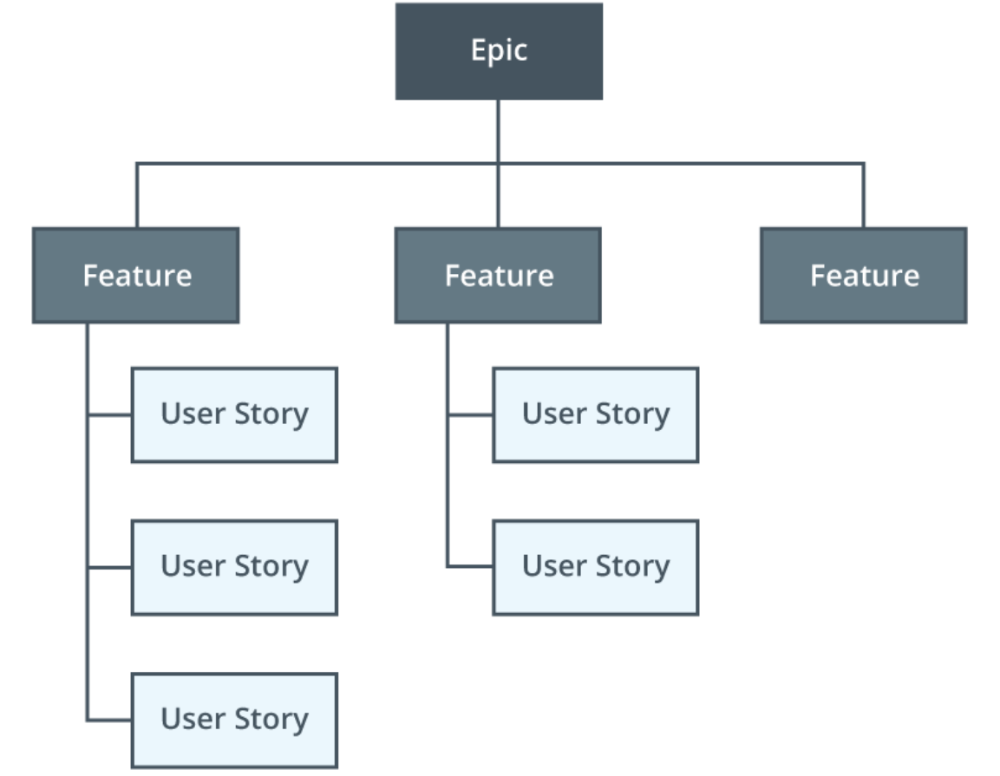
- **WBS vs Product Backlog vs Project Backlog**
  - product backlog: alive as long as the product is active.
  - project backlog: have start and end dates.

|                         | WBS               | Project Backlog             | Product Backlog              |
| :---------------------- | :---------------- | :-------------------------- | :--------------------------- |
| Duration                | Length of project | Length of project           | As long as product is viable |
| Scope                   | Fixed             | Flexible                    | Flexible                     |
| Resources               | Fixed             | Fixed                       | Fixed                        |
| Time                    | Fixed             | Fixed                       | Fixed                        |
| Deliverable or Activity | Deliverable       | Deliverable                 | Deliverable                  |
| Hierarchy               | Numbered Levels   | Epic > Feature > User Story | Epic > Feature > User Story  |
| When Created            | Planning Phase    | All Phases                  | Entire Life Cycle            |

## Charts

- **Burnup/Burndown Chart**
  - shows remaining time and work in each scrum sprint iteration.
  - 
- **Critical Path Method (CPM)**
  - shows how delay time will effect project.
  - add all activities with dependencies to find longest path on chart.
  - Float: the down time activity has and can still be completed on time.
  - 
- **Fishbone/Ishikaawa Diagrams**
  - cause and effect diagram. Part of gap analysis.
  - shows how various factors(fish bones) impact single outcome(fish head).
  - 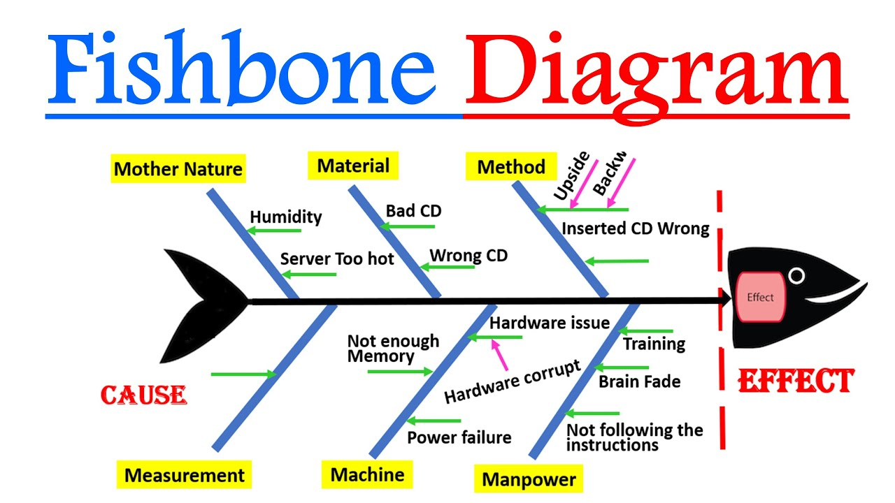
- **Gantt Chart**
  - Gantt Chart: highly detailed relationship and dependencies between task. focus is on task.
  - planning, execution, closing phase.
  - 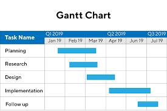
- **Milestone or Timeline Chart**
  - simple timeline chart of project milestones. focus is on events.
  - 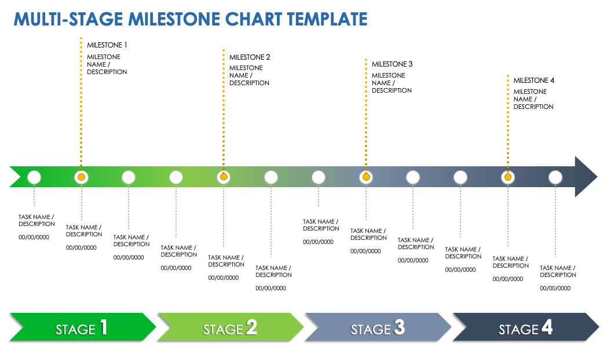
  - Milestone chart
  - 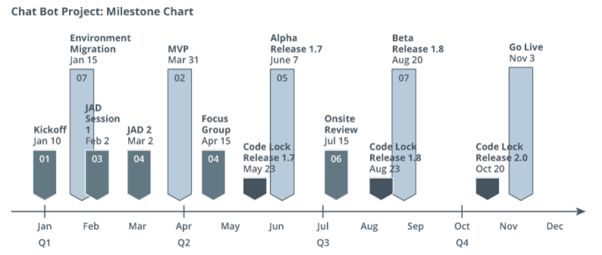
- **Project Organizational Chart**
  - Project Organizational Chart: once you know project scope, the organizational chart helps to pick your team members.
  - 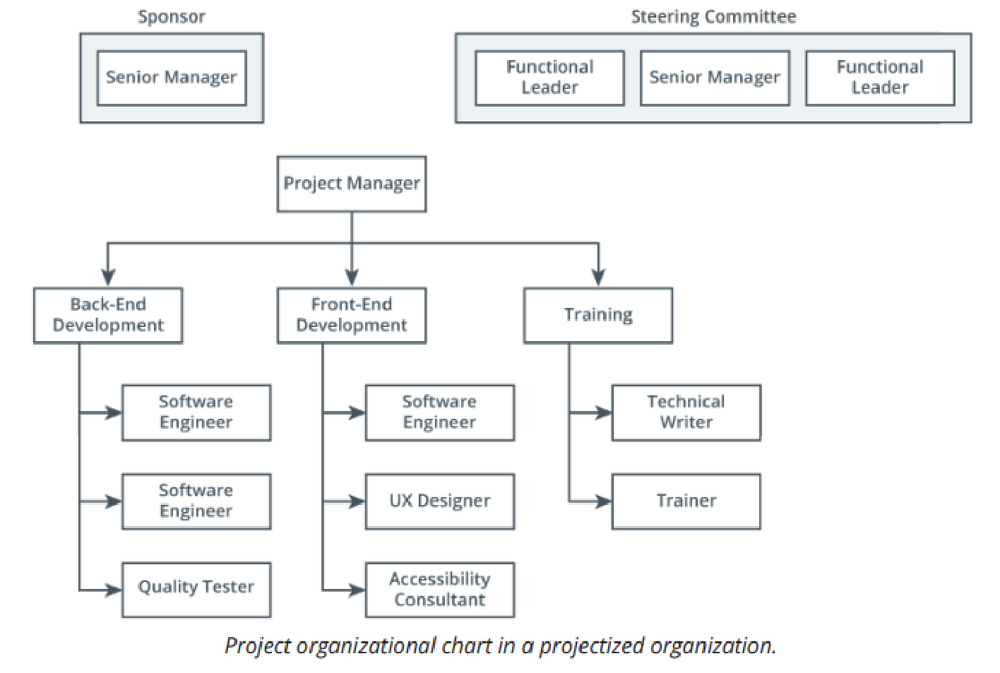
- **Histogram**
  - monitor process over time. Show varying frequency.
  - 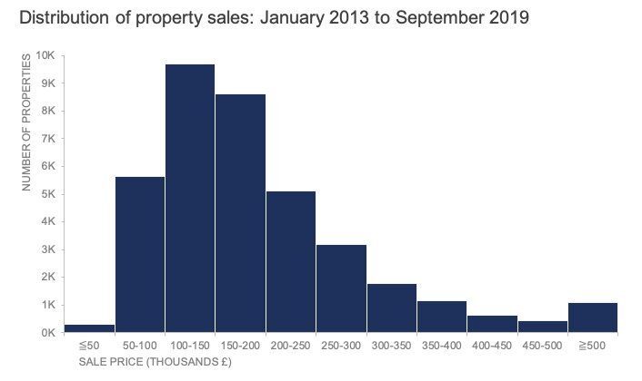
- **Pareto Chart**
  - 80/20 rule. 80% problems solved with 20% cause.
  - what generates the most benefit with least effort.
  - 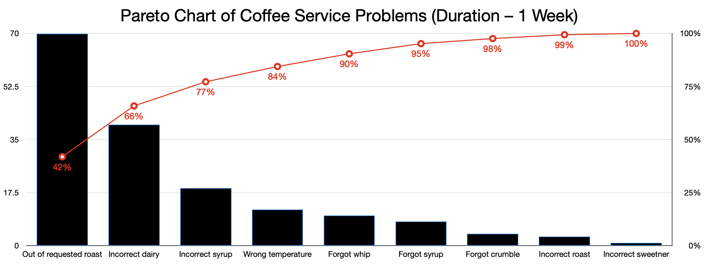
- **Program Evaluation Review Technique (PERT) Chart**
  - shows duration, activities, dependencies. Typically used in **large, complex projects.**
  - Uses 3 point estimates: `optimistic time + pessimistic time + (4 * average time) / 6 = estimated time.`
  - 
- **Project Network Diagram**
  - visual model of the project schedule that shows sequence of activities and the dependencies.
  - 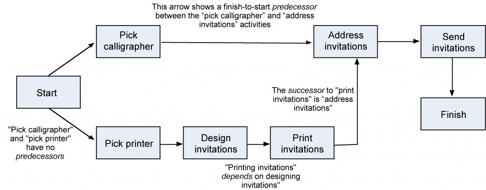
- **Run Chart**
- **Scatter Diagrams**
- **Control Chart**
- **Velocity Chart**
- **Decision Tree**
  - 

## Communication Management and Meetings

- **Synchronous Communication**
  - real-time communication. Face-to-face(in person or videoconference) with all parties.
- **Asynchronous Communication**
  - delay in communication. email. documentation notes.
- **Written Communication**
  - exchanges occur through handwritten/typed messages.
- **Verbal Communication**
  - oral communication
- **Nonverbal Communication**
  - body language and appearance. Signals sent when in person.
- **Formality Communication**
  - company channels to communicate. Official record.
- **Informal Communication**
  - unofficial communication. Casual conversation between coworkers, group chatter before meeting. Nonverbal communication during meeting.
- **Internal Communication**
  - communication inside the business.
- **External Communication**
  - communication outside the business.
- **Communication Tools: Email, Messaging, Telephone, Meeting face-to-face, Video, Enterprise Social Media**
  - Email: allow response at leisure.
  - Messaging: SMS: text. Chat: exchange via internet.
  - Telephone: fastest for large geographical boundaries.
  - Meeting face-to-face: most information. body language, facial expressions, voice tone change.
  - Video: blend face-to-face with telephone.
  - Enterprise Social Media: internal communication network.
- **Target Audience**
  - who needs to be at the meeting.
- **Facilitator**
  - guides meeting progress. redirect flow if meeting off track.
- **Scribe**
  - records meeting minutes, action items, and follow-ups.
  - mandatory for meeting on the official record.
  - not needed for training sessions.
- **Demonstrations and Presentations Meetings**
  - video, slide show, actual product.
- **Status Meeting**
  - update on progress of project.
- **Stand-ups**
  - focused, quick meeting. Popular in Scrum Daily stand-ups. Sometimes doing it standing up.
- **Decisive Meetings**
  - decision-making meeting.
- **Decisive Meeting: Task Setting**
  - assign task to be completed.
- **Decisive Meeting: Project Steering**
  - to keep projects on track and successful.
  - includes the PM and executive stakeholders. Offer support and guidance throughout project lifecycle.
  - can represents voice of the customer.
- **Refinement Meeting**
  - also called: product refinement or backlog refinement.
  - re-prioritize backlog items. Most important at top, broken down into task.
- **Collaborative Meeting**
  - interactive, problem solving meeting.
- **Focus Groups**
  - Project manager runs meeting to gather experiences, needs, problems from customers.
- **Workshops**
  - group with shared interest gather to exchange information and conduct research.
  - solve problems or increase knowledge(skill development).
- **Joint Application Development (JAD)**
  - also called: joint application review.
  - specific type of workshop that involves the customer in the design process.
  - early feedback.
- **Brainstorming: Rapid, Reverse, Stop-and-Go, Round-Robin**
  - Rapid: group rapidly generates many ideas. everybody can participate. Quantity over quality.
  - Reverse: look at problem from different angles. ex.. Why you couldn't solve problem.
  - Stop-and-Go: brainstorm short duration then refine ideas. Quality over Quantity.
  - Round-Robin: everyone gets equal voice.
- **Agenda**
  - meeting purpose and expectation. Shared in advance.
- **Meeting Timeboxing**
  - fixed maximum time on each agenda item.
- **Meeting Action Items**
  - list of task someone will complete after meeting.
- **Meeting Minutes**
  - written record of key points.
- **Meeting Follow-up**
  - after meeting email with minutes(meeting recap).
- **Language Barriers, Time Zones, Geographical Factors**
  - interpreters, appropriate communication formats.
  - Time Zones adn Geographical Factors: what works best for them?
- **Technology Factors**
  - slower internet, older hardware. Project manager can provide tools needed.
- **Cultural Differences**
  - any group with social customs, behavior, habits, beliefs.
  - foster respect for each others beliefs. Team bonding.
- **Team Lifecycle: Forming, Storming, Norming, Performing, Adjourning**
  - teams will have a performance ebb and flow.
  - Teams need different types of support and leadership through different positions of lifecycle.
  - Forming: team first time together.
  - Storming: team figure out roles and each others flaws.
  - Norming: positive exchange and cohesiveness between team members.
  - Performing: max cohesiveness and performance.
  - Adjourning: team breaks apart.
  - 
- **Conflict Managing: Smoothing**
  - redirect attention away from conflict.
  - 
- **Conflict Managing: Forcing**
  - make the decision without discussing it.
  - ex.. in a fire, just put it out, don't form a committee.
  - 
- **Conflict Managing: Compromise**
  - both parties meet in the middle.
  - 
- **Conflict Managing: Collaboration**
  - both parties collaborate new idea that works as a win-win for both parties.
  - 
- **Conflict Managing: Avoiding**
  - ignore the conflict. Problem is small or not affecting performance.
  - 

## Data Confidentiality and Security

- **Access Data, Remote Access, MFA, Removable Media, Mobile Devices, Facility Access, Background Screening, Security Clearance**
  - typically use roles. least privilege.
  - remote access policy: who can connect and how.
  - Multi-Factor Authentication: two or more credentials.
    - something you know(password), something you are(biometrics), something you have(key card).
  - Removable Media: usb restrictions.
  - Mobile Devices: Mobile Device Management (MDM) software.
  - Facility Access: prevent unauthorized access. Key cards, biometric locks...
  - Background Screening: checks education, certificates, references, criminal history.
  - Security Clearance: anyone who accesses national security information must pass credit and criminal investigation.
- **Confidential Data**
  - limited access to authorized users only.
- **Data Confidentiality**
  - protecting sensitive data that identify individuals personal information.
- **Internal Data**
  - within company only. Exposing would not violate laws or trust.
- **Intellectual Property**
  - company owned data. Patents, copyrights, trademarks, trade secrets.
- **Public Data**
  - no restrictions
- **Top Secret**
  - exposure could damage national security.
- **Trade Secrets**
  - competitive advantage. Leaked data could result in great harm to business.
- **Restricted Data**
  - top secret. Criminal charges if exposed.
- **GDPR (General Data Protection Regulation)**
  - EU PII data handling requirements. Also adds to NIST, classifying: cookies, radio frequency tags, IP addresses as PII.
- **PII (Personally Identifiable Information)**
  - any information about an individual (social security number, date of birth, mothers maiden name, medical, biometric, financial, educational, employment...)
  - organizations should develope policies and procedures(educate, train) to handle PII and data breaches.
  - Anonymize sensitive data before sharing.
- **Linkable PII**
  - personal identifiable info that can be linked together to create SPII.
  - name, address, email, MAC, phone, race, age, credit card...
- **SPII (Sensitive Personally Identifiable Information)**
  - subset of PII. Any single piece of data that could identify and cause harm or embarrassment.
  - SSN, Passport, Drivers License, Biometric.
- **PHI (Personal Health Information)**
  - IIHI (Individually Identifiable Health Information)
  - past, present, and future health or mental condition.
- **HIPAA (Health Insurance Portability and Accountability Act of 1996)**
  - provides regulations for safekeeping persons personal health records.
  - **(ePHI) electronic Personal Health Information**.
- **NIST (National Instituted of Standards and Technology)**
  - federal agency creates frameworks and process to help protect information.
  - describes 3 levels: low, medium, high impact.

## DevOps, DevSecOps and CI/CD

- **DevOps**
  - automating checks and tests along with development and operations.
  - Problem: Siloed development and operations teams create communication barriers, inefficiencies, and slow code delivery.
  - Solution: DevOps integrates these teams, practices, and tools to optimize the entire software delivery process.
  - Automation: CI/CD automates builds, tests, and deployments for faster releases.
  - Continuous feedback: Early detection and fix of bugs through frequent integration and monitoring.
- **DevOps Strengths**
  - Faster delivery of quality software by eliminating the barrier between development and operations.
  - Improved operational support and cross-functional collaboration.
  - Reduced friction and project risks.
- **DevOps Weaknesses**
  - Requires specialized skills and cultural shift.
  - Difficult to implement for large/legacy systems with minimal automation.
- **DevOps Use Cases**
  -Teams striving for CI/CD and faster releases w/ automation.
  -Companies with resources for cross-functional teams and automation tools.
- **DevOps 4 Phases**
  - plan, code, build, test.
- **DevSecOps**
  - Baking Security into DevOps(entire software development lifecycle) for Faster, **Secure Software Delivery**
  - Importance: Secure systems are crucial for consumer trust, competitive advantage, and regulatory compliance.
- **DevSecOps Strengths**
  - Faster delivery, continuous security feedback, and reduced risk of breaches.
- **DevSecOps Weaknesses**
  - Users may need support and training, security teams must relinquish control, and frequent deployments create higher security demands.
- **CI/CD**
  - Individual developers check their code into the main branch frequently, and automated tests run against the new code.
- **Continuous Integration**
  - Developers merge code frequently, triggering automated tests for early feedback.
- **Continuous Delivery**
  - Code automatically prepared for release but deployment is manual.
- **Continuous Deployment**
  - Code automatically prepared for release and deployment is automatic.

## Extreme Programming

- **Extreme Programming**
  - agile framework. software development. pair programming, emphasis on simplicity.
  - XP: close collaboration, iterative development, and continuous testing.
- **Extreme Programming Pair programming**
  - Two developers work together on code, promoting continuous review and knowledge sharing.
- **Extreme Programming Ten-minute build**
  - Ensures rapid feedback and keeps code clean through fast builds and tests.
- **Extreme Programming Continuous integration**
  - Frequent merging of code to prevent conflicts and enable automated builds/tests.
- **Extreme Programming Test-first programming**
  - Writing tests before code drives simplicity and quality.
- **Extreme Programming Incremental design**
  - Small, frequent improvements over delayed releases.
- **Extreme Programming Open workspace**
  - Fosters communication and teamwork by removing physical barriers(walls). Everyone in same room.
- **Extreme Programming On-site customer**
  - Integrates the customer into the team for direct feedback and collaboration.
- **Extreme Programming 40-hour workweeks**
  - Prioritizes developer well-being and avoids burnout.
- **Extreme Programming User stories**
  - Clear and concise requirements format for effective communication.
- **Extreme Programming Weekly and quarterly cycles**
  - Regular planning, adaptation, and reflection.
- **Extreme Programming Built-in flexibility**
  - Slack in weekly plans allows for adjustments and unforeseen situations.
- **3 Roles in Extreme Programming**
  - Customer: decide features and priority.
  - Tracker: capture metrics, progress, improvements.
  - Coach: mentor team members.
- **Extreme Programming Strengths**
  - Highly efficient and adaptable.
  - Prioritizes essential features and continuous improvement.
  - Strong team cohesion and reduced project failure.
  - Values developer well-being.
- **Extreme Programming Weaknesses**
  - Limited scope to software development (not ideal for non-software projects).
  - Potential for design neglect due to code-centric practices.
  - Rapid pace and minimal documentation can be stressful and hinder onboarding.
  - Reliance on face-to-face interaction (can be challenging for remote teams).
- **Extreme Programming Use Cases**
  - Small, collocated teams with changing requirements and tight deadlines.
  - Projects with strong test automation capabilities.

## Financial and Performance Analysis

- **Assumptions**
  - future factors you state as true to present a financial plan.
- **Benefit**
  - money generated or saved from project.
  - also called 'financial value' or 'revenue'.
- **Cost**
  - anything related to project that causes money to flow out of company.
- **Cost-Benefit Analysis**
  - cost to produce vs benefit.
  - timeline of how quickly money can be recouped.
- **Financial Analysis**
  - assigning hard numbers to future events.
- **Net Profit**
  - NET = `benefit - cost`
- **Revenue**
  - money flowing into company as result of project.
- **Scoring Model**
  - rating/weight each project or alternative solution from predefined list of criteria.
  - often includes a 'minimum' rating. Project discarded if not meet minimum.
- **Payback Period**
  - time to recover from all cost of producing product.
- **FV (Future Value) vs PV (Present Value)**
  - include inflation into the cost.
  - Future Value = Present Value(1+interest)^years
- **ROI**
  - percentage of gain for investment.
  - ROI = `(net profit / cost) * 100` // same
  - ROI = `(revenue - cost) * 100` // same
  - ROI = `((Financial Value - cost) / cost) * 100` // same
- **IRR**
  - Internal Rate of Return: profitability of an investment as an average percent over the life of the investment.
  - Higher better.
- **Current State vs Future State or as is-to be, Performance Analysis**
  - how change will effect the business in the future.
  - as is-to-be(also called performance analysis): means same.
- **Discounted Cash Flow**
  - total value of each years expected cash inflow, in 'todays' dollars.
- **NPV**
  - net present value.

## IT Infrastructure and Software

- **Describe: Computing Services, Multitiered Architecture, Networking and Connectivity, Storage, Data Wharehouse, Documentation**
  - Computing Services: any IT infrastructure a project may need. Software(ERP), hardware(laptop, pc), services(IaaS, PaaS).
  - Multitiered Architecture: divide software into tiers and layers. Modular design allows for redundancy.
  - Networking and Connectivity: how various components connect(networking).
  - Storage: data location, security, redundancy.
  - Data Wharehouse: extensive database for reporting and analytics.
  - Documentation: documentation about IT infrastructure.
- **IaaS, PaaS, SaaS, XaaS**

  - Infrastructure as a Service:
  - Platform as a Service:
  - Software as a Service:
  - Anything as a Service:

  | Platform | Cloud Provider Includes                                     |
  | -------- | ----------------------------------------------------------- |
  | IaaS     | physical hardware + hardware management software            |
  | PaaS     | IaaS + OS + app development environment(java, python, node) |
  | SaaS     | PaaS + complete app. You bring your data                    |
  | XaaS     | any third party service.                                    |

- **Ticketing or Case Management System**
  - manages customer problem tickets. Automated workflow route customer problem to person who can help.
- **Project Management Scheduling Tools**
  - schedule, plan, and track project timeline.
- **Meeting Tools: Calendaring, Real-Time Survey Poll, Print Media, Conference Platforms, Real-Time Multi-Authoring Editing Software, File Sharing Platform, Wiki and Knowledge Base, Whiteboard**
  - Calendaring: manage multiple calendar, schedules, time zones, alerts.
  - Real-Time Survey Poll: quickly gather information from groups of people.
  - Print Media: create posters, flip charts, brochures, manuals.
  - Conference Platforms: video(zoom, teams).
- **Productivity Tools: Word Processing, Spreadsheet, Presentation, Diagramming, Real-Time Multi-Authoring Editing Software, File Sharing, Wiki, **
  - Word Processing: text document editor.
  - Spreadsheets: data in tables.
  - Presentation: slide show.
  - Diagramming: visually represent process.
  - Real-Time Multi-Authoring Editing Software: multiple people can collaborate at same time.
  - File Sharing Platform: grant file access to multiple users.
  - Wiki: everyone can contribute content. Best when multiple people contribute.
  - Knowledge Base: specific authors contribute. Best for when appearance and simplicity matter(FAQ's).
  - Whiteboard: virtual creative space.
- **ERP (Enterprise Resource Planning)**
  - back office software to coordinate: accounting, human resources, procurement...
  - centralizes management and access for data sharing between roles. Data and API(functionality) centralized.
- **Financial Systems**
  - subset of ERP for the financial budget, spending, and cost estimates.
- **Electronic Document Management System (EDMSs) and Records Management System (RMS)**
  - both are the same thing.
  - software that manages records(artifacts, documents, contracts) lifecycle.
  - enforces government regulations, retention policies.
- **Content Management System (CMS)**
  - interface that hides code complexity from end-user.
  - ex.. create website without technical knowledge.
- **Customer Relationship Management (CRM)**
  - manage relationship w/customers and future customers.
  - Allows for tech support(notes, tracking problems).

## Kanban

- **Kanban**
  - agile framework.
  - Kanban board: Visualizes work, WIP(work in progress) limits, and workflow policies.
  - track task flow and optimize workflow.
  - Simplest agile framework to learn and can be applied to any industry.
- **Kanban 3 basic phases**
  - To Do, In Progress, Done (can be customized).
- **Kanban 6 Core Practices**
  1. Visualize work: show phase work is in.
  2. Limit WIP: prevent overwhelm, increase product quality by restricting active tasks.
  3. Make policies explicit: clearly define how work moves through phases.
  4. Manage flow: Identify and eliminate workflow bottlenecks for efficiency.
  5. Implement feedback loops: Measure workflow performance and use data for improvement.
  6. Improve collaboratively: Experiment and continuously evolve the workflow.
- **Kanban 4-part workflow**
  - Prioritize backlog, pull work into progress, move through phases, start new work.
- **Kanban Strengths**
  - Simple to learn, flexible, applicable to any industry with routine tasks.
  - Lightweight, focuses on reasonable amount of work and clear policies.
- **Kanban Weaknesses**
  - Requires stable work environment, can struggle with large teams or high turnover.
  - Cycle times may lengthen without set iterations and proper performance management.
- **Kanban Use Cases**
  - Teams with frequently changing backlogs (e.g., ticketing systems)
  - Teams comfortable with less structure and stable workflows.

## PRINCE2

- **PRINCE2**
  - process-based methodology. Common in UK, EU, Canada, Australia.
  - focus on clear project phases, roles, and responsibilities.
  - originally waterfall methodology, but has embraced the agile model.
  - has 7 principles, 7 themes, 7 processes.
- **PRINCE2 Team Manager**
  - management team member focused on helping project manager.
- **PRINCE2 Project Board**
  - authorizes resources and funding in support of project manager.
- **PRINCE2 Project Board Three Roles**
  1. **Executive**: member of upper management represents business perspective, owns project business case.
  2. **Senior User**: represents customer perspective.
  3. **Senior Supplier**: represents supplier perspective.
- **PRINCE2 Strengths**
  - very flexible with any project.
  - greater upper management involvement.
  - constant communication between project board, manager, and teams.
- **PRINCE2 Weaknesses**
  - extensive documentation.

## Projects and Members

- **Project**
  - temporary organization created to deliver one or more business products according to the business-case.
- **What Makes it a Project**
  - mnemonic: 'STU'
  - **Unique**: meet specific business objective.
  - **Temporary**: start and end date.
  - **Stakeholder Satisfaction**: ends when stakeholder is satisfied.
- **Needs and demands of why projects come about**
  - Market Demand, Organizational Need, Customer Request, Technological Advance, Legal Requirement, Ecological Impact, Social Need.
- **Architect**
  - part of the IT team. design. Make sure project interoperates with business goals.
  - Responsibilities:
    - Solution design
    - System blueprints
    - Evaluating systems against organizational standards
- **Artifacts**
  - preexisting knowledge, documentation(lessons learned) or vetted vendors to be used in project planning.
- **Business Analyst**
  - **gathering and documenting** requirements for project.
  - works between the business side and the IT side.
  - Responsibilities:
    - Helping to define the project
    - Gathering business and technical requirements
    - Ensuring requirements stay aligned to needs
    - Interpreting business requirements
    - Verifying deliverables against requirements
    - Assisting with testing and validation of products
- **Business Case**
  - **Justifies the project**'s viability(most important) and alignment with business goals.
  - summarizes project and is first project proposal. Determines if project should proceed.
  - created in discovery phase. Often includes details about budget and timelines(start, end).
  - mnemonic: 'Executive Statements Offer Financial Projects Recommendation'
    - Executive Summary: brief summary. problem statement, solution, result.
    - Problem Statement: problem trying to solve.
      - Problem Analysis: more details about why project should be prioritized.
    - Options: pros and cons of multiple solutions.
    - Financial Overview: cost-benefit on investment.
    - Project Definition: more info. scope, resources, milestones, timeline.
    - Recommendation: analysis which option is best for organization objectives.
    -
  - Analyzes the:
    - Problem or opportunity the project addresses.
    - Alternative solutions and their costs/benefits.
    - Projected financial impact on the organization.
    - Risks and mitigation strategies.
  - Function:
    - Secures executive buy-in and funding for the project.
    - Demonstrates the value proposition and return on investment.
    - Guides project prioritization and decision-making.
    - Provides ongoing performance benchmarks and justification.
  - mnemonic: 'JAFAR DASH'
  - **Justification**: benefits to organization.
  - **Alignment to the Strategic Plan**: project aligns with organizations overall strategy.
  - **Feasibility Study Results**: determine if project is doable and likely to succeed.
  - **Analysis of the Problem or Opportunity**: gap analysis: compare where we are and where we want to go.
  - **Recommended Solutions**: expected results and impact.
  - **Description**: describe the project.
  - **Alternative Solutions**: expected results and impact from alternative solution.
  - **Stakeholders**: anyone/organization with vested interest.
  - **High-Level Risk Analysis**: known risk documented.
- **Business Storytelling: Current State vs Future State**
  - either tell a good story of Current state vs. Future state with descriptive words or charts.
  - both sides must use same metrics.
  - Current State: whats going on right now.
  - Future State: what will change after project.
- **Core Team Members**
  - also called 'operational' team members because they focus on day-to-day operations.
- **Customers: Internal, External, End-User**
  - Internal: inside organization. easy feedback.
  - External: outside organization. typically pay for product.
  - End-User: physical user of final product. Can also provide insight on usability and functionality.
- **Decision Model**
  - apples-to-apples way of comparing projects and which one is the most benefit to company needs.
  - **Rewards**
    - Cost-benefit analysis, Scoring models, Payback period, Discounted cash flow, Net present value, Internal rate of return, Return on investment.
  - **Constrained Optimization Model**
    - mathmatical model for highly complex projects.
- **Developer/Engineer**
  - writing program frontend/backend code.
  - Responsibilities:
    - Writing code to standards
    - Building products according to the project plan or sprint backlog
    - Reporting development progress to the project manager or product owner
- **Expert Judgement**
  - expertise of stakeholder or other subject matter expert to make project decisions.
  - Danger lies with relying on single technique to make selection.
- **Extended Team Member**
  - work part time on multiple projects.
- **Key Performance Indicator (KPI)**
  - operational metrics, that measures only the most crucial project points.
- **Key Performance Indicator (KPI): Lagging and Leading Indicators**
  - Lagging: captured only after work is done.
  - Leading: predictive measures.
- **Milestone and Sprint Goals**
  - Milestone:
    - critical checkpoint in a project. Date dependant event.
    - short milestones help keep project momentum, too many cause fatigue.
  - Sprint Goals:
    - at the start of agile sprint, sprint goal is created that reflects the expected outcome.
- **Objective and Key Results (OKR)**
  - aspirational, slightly out of reach goals to drive teams value further than they thought possible.
  - less is more. focus on the critical needs.
  - Two parts:
    - Objective: goal and why it matters.
    - Key Result: what you need to do to meet the goal.
  - 
- **PMO (Project Management Office)**
  - Functional department for all project managers.
  - manages flow of projects and provides guidance to project managers with organization resources.
- **PMO Supportive Project Management Office**
  - Provides support when it is requested
- **PMO Controlling Project Management Office**
  - Monitors project performance and coordinates resource selection while allocating project managers to projects
  - The controlling PMO coordinates communications and sets some project standards
- **PMO Directive Project Management Office**
  - Has full authority over projects, standards, and procedures
  - It focuses on organizational strategy and will start, cancel, or adjust projects to ensure strategic alignment
- **Portfolios**
  - prioritize and execute multiple projects/programs more efficiently.
  - support strategic business goals or objectives.
  - Portfolios may consist of multiple projects/programs without related objectives.
- **Portfolios Enterprise**
  - contain all programs/projects.
  - can be broken down into sub-portfolios at division or branch level.
- **Portfolio Management**
  - strategy to maintain and prioritize maximum programs/projects.
- **Preliminary Scope**
  - Preliminary scope statement defines the objectives of the project and explains the business reason the project is trying to solve.
- **Product Owners**
  - help agile teams stay on track with cost, scope, and time.
  - **creating a valuable product and identifying how to improve a product**. Keeping to product vision.
  - create work, but do not manage. Act as customer proxy.
- **Product Manager**
  - **define product strategy**, create roadmap on how product will improve and change over time.
- **Programs**
  - group projects with related objectives to achieve a larger objective.
  - bring about benefits that wouldn’t be achievable if the projects were managed separately.
- **Program Manager**
  - lead groups of projects. Operates at a more strategic level.
  - helps capitalize on the resources of multiple projects.
  - project managers report to them(makes them a stakeholder and your boss).
- **Project Baseline**
  - approved cost, schedule, scope, plans, and documents.
  - used to measure performance/progress. Determine if on schedule, within budget or on target.
- **Project Management Office (PMO)**
  - central location for guidance, standards, artifacts to project managers, programs and portfolios.
  - allows organization to capitalize on the collective benefits of all projects.
  - Functions:
    - organized standards and processes.
    - coordination of resources, templates, artifacts.
    - governance and setting priorities.
    - KPI, performance standards and nonperformance consequences.
- **Project Manager**
  - runs day-to-day management of teams in any framework as long as the project is active.
  - explains benefits of project to stakeholder. All stakeholders(something to gain or lose) must be sold and sign-off, otherwise project may be blocked.
  - keeps project sponsor notified of status, conflicts and risk.
  - responsibilities: **planning, scheduling, documents, progress, risk, fixed time, cost and scope**.
  - completes project goals to stakeholder/company satisfaction.
  - Responsibilities:
    - Building the project team and securing resources
    - Building the project charter and defining the project’s scope
    - Creating required project logs and processes, including the issue log, change log, and risk register
    - Ensuring project deliverables are met which includes making sure team members have the right skills and resources for activity completion on the activity list
    - Preparing and delivering project status updates
    - Tracking the project’s progress and status when compared to the schedule and budget
    - Managing vendor relationships
- **Project Manager Skills**
  - leadership, communication, problem-solving, negotiation, organization, time management.
- **Project Manager: Managing a Project Team**
  - manage team and resources for team.
- **Project Manager: Communicating with Stakeholders and Team Members**
  - sponsors, stakeholders, team members up-to-date. Start -> Finish.
- **Project Manager Scope**
  - goals, deliverables, and requirements of the project.
- **Project Manager Risk**
  - identify, manage, track, monitor risk.
- **Project Manager Budget**
  - alert if cost higher than expected or funds running out.
- **Project Manager Schedule**
  - key deliverables are performed on time.
- **Project Manager Quality Assurance**
  - quality of deliverables meet standards
- **Project Manager Project Artifacts**
  - documents, templates, agendas, diagrams. Project charter is artifact.
- **Project Selection Method**
  - senior members choose project based on documents provided (market share, financial benefits, return on investment, customer satisfaction, and public perception).
- **Project Sponsor**
  - ultimately responsible for the success or failure of project. Delegates operations to project manager.
  - usually **senior executive** that assigns **money** and **resources** to project.
  - approves project charter by **signing**.
  - **Tie-breaker, champion, adviser of project**.
  - Responsibilities:
    - find/provide funding
    - sign charter. Approve baseline(starting point of project, schedule, scope), high-level requirements.
    - define business case.
    - authorize assignment of human resources.
    - assigns project manager and define their authority.
    - negotiate support from key stakeholders. Champion and market project.
    - enforce milestones by removing road blocks.
- **Senior Management**
  - highest level of leadership.
  - control organizational goals, communicate with shareholders and board members.
  - prioritize projects, authorize spending, assign team members.
- **SMART Objective**
  - Specific: define exactly what is needed.
  - Measurable: what change to look for.
  - Achievable: realistic goal.
  - Relevant: align with business goals.
  - Time-Bound: target end date.
- **Sponsors**
  - single senior manager reviews/validates initial business case.
  - secures funding and removes barriers.
- **Stakeholder**
  - Anyone/Organization with vested interest(positive or negative) in the project.
  - **Waterfall**: detailed requirements given to team. No further communication until project completion.
  - **Agile**: communication between team and stakeholder throughout the project.
  - Responsibilities:
    - Must understand the project’s purpose and how it will affect them.
    - Be transparent about their support or lack of support
    - Provide timely feedback on the project’s progress
- **Stakeholder Analysis**
  - asking questions to gather role(level of involvement, influence), needs/concerns.
  - Questions:
    - What is your interest in project?
    - expectations of outcome?
    - what is do you anticipate as your level of involvement?
    - knowledge level in project? What do you see as special skills needed for successful outcome?
    - what contributions are you anticipating making?
    - How will project impact your organization positively/negatively?
    - Are there other stakeholders expectations that conflict with yours?
    - Use these questions to fill out the Stakeholder Analysis Grid:
      - 
- **Stakeholder Register**
  - roster with name, phone, role(level of involvement, influence), needs/concerns. Tracks multiple stakeholders.
- **SMEs (Subject Matter Experts)**
  - team members performing the work. have the specific knowledge and experience to do the work.
- **Team Member and Extended Team Member**
  - **Team Member**: knowledgeable person either full time.
    - keep timeline, cost of project.
    - communicate with project manager risk, updates.
  - **Extended Team Member**: also called Fractional Team Member.
    - Only available part time. Typically Subject Matter Expert.
- **Tester/Quality Assurance**
  - ensure requirements are met. help prevent errors.
- **Validate a Project**
  - write business case, identify and analyze stakeholders.
- **Vendor**
  - third party provides resources.
  - Responsibilities:
    - Provide work outlined in contracts
    - Maintain service level agreements
    - Keep clear lines of communication open for business relationships

## Project Lifecycle Phase 1 Discovery

- **Discovery/Concept Phase**
  - first phase. determine whether project is worthwhile/justified.
  - business case is created.
- **Discovery: Business Case**
  - Looks for ways(artifacts) to speed up the project: prequalified vendors, clients, contracts.
  - **If project considered risky**
    - Perform **feasibility study**: new projects, complex projects, risky projects.

## Project Lifecycle Phase 1 Initiating

- **Initiating Project**
  - after business case is approved, formal authorization for a new project to begin.
  - Next: preliminary scope statement, project charter, team assembled.
- **Initiating Project: Preliminary Scope Statement**
  - **clearly defines how the work will be done**.
  - after business case, preliminary scope statement is **first artifact created** and will become part of the project charter.
  - preliminary scope statement and the scope statement are the same. Only difference is maturity.
  - document grows with project becomes more mature. This document will be the reference for the planning phase.
  - Functions:
    - Scope Description: summary project intent and purpose.
    - Acceptance Criteria: description of successful project.
    - Deliverables: project boundaries and what team will deliver.
    - Exclusions: what team will not deliver.
    - Assumptions: the project unknowns as known.
    - Constraints: what has to be worked around and could delay project.
- **Initiating Project: Project Charter**
  - **high level explanation of why the project exit**.
  - objectives should be clear, measurable, actionable.
  - questioning project requestor to ensure problem is clearly understood.
  - officially recognizes the project has begun. First official document of Approved project.
  - source of truth for the project. It describes the vision and direction of the entire project.
  - written by product manager and delivered to all stakeholders, but signed and approved by project sponsor.
    - check project management office for template or required format. some answers can be taken from business case.
    - use artifacts to observe lessons learned from past experiences.
  - Project Charter Functions:
    - Justify project: reiterate business case.
    - Objective and deliverables: clearly define desired result, deliverables and start, end date.
    - Scope and boundaries: clarifies project manager and team members(needed skills) roles and authority level.
    - Assumptions: based on previous experience, you can expect similar.
    - Timeline and milestones: tracking(on schedule) details on each stage of project.
    - Requirements and budget: List all blockers, and high-level resource estimation.
    - Key stakeholders and roles: clarifies purpose and expectation for stakeholders.
    - Constraints and Risk: Something fixed(must be worked around). Threat to project(missed deadline).
    - Success criteria: delivered on time, within budget, meets goals(fit, regulations, quality, performance).
    - Signatures: Project sponsor must review and sign off.
  - after project charter is signed, identify people who will do the work and have the right skills.
- **Initiating Project: Stakeholder**
  - engage stakeholder to build and manage relationship throughout project.
  - Engagement Plan:
    - Stakeholder: List the person or group.
    - Point of Contact: If the stakeholder is not a person, list the person who represents the stakeholder.
    - Power: List the power level from the Power/Impact Grid
    - Influence: List their impact level from the Power/Impact Grid.
    - Project Phase: List the project phases that you will need to engage with them
    - Engagement Needs: Describe what they need or why they are a key stakeholder
    - Engagement Approach: List the type of engagement you will conduct from the
    - Power/Impact Grid
      - 
    - Methods: Capture how you will communicate with them
    - Frequency: List a descriptive term of how often you will engage with the stakeholder
- **Initializing Project: Records Management**
  - CRUD(create, read, update, delete) policies for documents and records.
  - where records are stored, liaisons listed, classification.
  - Types of records:
    - Management Artifacts: budget, stakeholder engagement...
    - Artifacts: documents created as project moves along.
    - Legal Documents: contracts.
    - Communications: written communication: meeting notes, status reports.
  - **Records Management System (RMS)**: software that manages record lifecycle.
    - enforces government regulations, retention policies.
- **Initializing Project: Access Requirements**
  - software that manages employees can access. Typically based on roles.
  - access is least privilege(only what is required).
- **Initiating Project: Kickoff**
  - live meeting with team. Discuss project purpose, goals, plan.
  - signifies start of the project work. Team roles identified.

## Project Lifecycle Phase 2 Planning

- **Planning Phase**
  - Prepare for the work of the project.
  - Objectives broken down into manageable units of work. Creation of plans or documents that are used throughout the project to ensure that goals of the project are being met.
- **Planning: Scope Statement**
  - agreement between customer and project team about the deliverables and success criteria.
- **Planning: Scope Statement Components**
  - living document. This is the preliminary scope statement as it grows to maturity.
  - Functions:
    - Description: summary project intent and purpose.
    - Acceptance Criteria: description of successful project.
    - Deliverables: project boundaries and what team will deliver. Specific and verifiable(measurable).
    - Exclusions: what team will not deliver.
    - Assumptions: believed to be true.
    - Constraints: what has to be worked around and could delay project(weather, laws, budget, time).
- **Planning: Requirements**
  - description of what makes the project a success.
  - can be part of scope statement or separate document.
- **Planning: Project Constraints and Assumptions**
  - constraints: restricts progress(weather, laws, budget, time).
  - assumptions: believed to be true.
- **Planning: Prince2**
  - popular UK, EU methodology. Any size project. Known for step-by-step(small stages) progress.
  - heavy documentation describes milestones of each step.
- **Planning: DevOps and DevSecOps**
  - DevOps: development team and operations team combined into one team. Improves collaboration.
  - DevSecOps: add security responsibilities to team.
- **Planning: SDLC**
  - plan, design, build, test, deploy.
  - waterfall and agile are methodologies of SDLC.
- **Planning: Three Types of SDLC**
  - waterfall, agile, hybrid.
- **Planning: Hybrid SDLC**
  - combining best parts of multiple methodologies(scrum+kanban = scrumban) to fit business goals.
- **Planning: Agile**
  - projects in small incremental portions.
  - continuous stakeholder feedback.
- **Planning: Difference Between Scrum and Kanban**
  - both are agile methods and both are known as 'pull systems'.
  - scrum: short sprints(time-bound).
  - kanban: continuous workflow. Visual board to track progress.
- **Planning: Scrum Team Roles**
  - product owner: voice of the customer.
  - scrum master: enforces scrum principles(daily standups).
  - scrum team: cross-functional team doing short time-bound sprints to create the MVP(minimum viable product).
    - user-stories are kept in backlog.
- **Planning: Scrum Minimum Viable Product**
  - MVP: breaking down features into small task that have enough features for customer to examine and provide feedback. Similar to prototype or mockup.
- **Planning: Scrum Backlog**
  - user stories needed to complete project.
- **Planning: List Agile Methodologies**
  - Extreme Programming(XP), Scrumban, feature-driven development, dynamic systems, Agile unified process.
- **Planning: Solutions Architect in Solutions Design**
  - solutions design: determine best technical solution for business problems.
    - function requirements: must haves from each stakeholder.
    - Non-functional requirements: implied must haves. (clean restaurant if looking for eating place)
  - solutions architect: determines solution, works closely with team and project manager.

## Project Lifecycle Phase 2 Planning: Communication/Escalation Plan

- **Communication Plan**
  - formed in phase 1, Initiating. Further refined in planning phase.
  - keep everyone involved in a project informed, engaged and aligned.
  - how team/stakeholders will receive project updates.
- **Develop a Communication Plan: Meeting Cadence and Methodologies**
  - depending on project size, stakeholder needs, urgency of project.
  - Cadence: frequency and format of meetings.
    - daily stand-up, weekly meetings, bi-weekly meetings.
    - meet more, faster burn-out and scope creep. Meet less, harder to share progress or change plans.
  - Methodology: most suitable type of communication based on project needs and audience.
    - In-person meetings, video conferencing, phone calls, Asynchronous communication(email, sms, chat...)
  - How To Do It:
    - identify team/stakeholders, best meeting methodology and cadence(time zones, urgency), basic personal preferences, communication preference.
    - project team:
  - 
- **Communication Records**
  - all the artifacts, meeting notes throughout the project.
- **Communication Records: Security**
  - proper classifying artifacts as company property.
    - Public data: no restrictions.
    - Confidential: authorized only.
    - Critical: top secret. Authorized only. Could include criminal charges.
- **Communication Records: Integrity**
  - artifacts and messages are not missing or changed.
  - proper meeting minutes by scribe.
  - preventing artifacts from being deleted.
- **Communication Records: Archiving**
  - keeping artifacts per business or government law requirements.
- **Escalation Plan**
  - formed in phase 1, Initiating. Further refined in planning phase.
  - artifact that outlines when event should be escalated and to whom.
  - 

## Project Lifecycle Phase 2 Planning: Scheduling, Dependencies, and Estimation

- **Scheduling**
  - defining units of work, cost, resources for a project.
- **Scheduling: Define and Create WBS**
  - Work Breakdown Structure: deliverable-oriented hierarchy that describes required work.
    - waterfall.
  - major deliverables are broken down into smaller components, for time and cost estimation.
  - 
- **Scheduling: WBS levels**
  - highest level: project name.
  - second level: major deliverables.
  - sub levels: subprojects.
  - lowest level: work package.
  - 
- **Scheduling: WBS Dictionary**
  - describes each deliverable, resources, tracking code(for accounting), criteria for success.
  - similar to 'scope'.
- **Scheduling: Analogous Estimating vs Bottom-Up Estimating**
  - Analogous: estimating top-Down. Expert judgement, historical information.
  - Bottom-Up: estimates for each work item, rolls them into a total.
- **Scheduling: Task Sequencing**
  - identify proper scheduling order of project activities.
- **Scheduling: Two Major Relationships between Dependent Task**
  - predecessor: project that must be completed before task.
  - successor: project that must be completed after task.
- **Scheduling: Three Most Common Activity Estimators**
  - Expert Judgement: someone experienced.
  - Analogous or Top-Down: artifact(similar activities) from previous project.
  - Parametric: quantitatively-based estimates (rate x quantity).
- **Scheduling: CPM**
  - Critical Path Method: finding the longest stretch to dependencies(sequential activities).
  - exposes task that risk missing the finish date.
  - Three things needed:
    - list of all project task.
    - project dependencies.
    - time each task will take.
- **Scheduling: Calculate Critical Path**
  - which path adds up to the longest. Any delay will result in missing the finish date.
  - 
- **Scheduling: Responsibility Assignment Matrix (RAM)**
  - created in the initiation phase. Activities are added in the planning phase.
  - clarifies team member assignment(ownership roles) and who to work with.
  - every activity must have one and only one accountable person.
  - **RACI**: (what role does team member fall into?)
    - responsible: do the work.
    - accountable: manager.
    - consulted: Subject Matter Experts.
    - informed: receive updates only(stakeholder, senior manager...).
    - 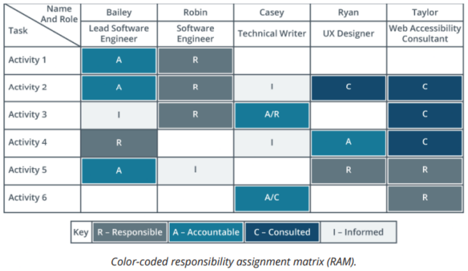
- **Define Critical Path Task**
  - critical path task activity with zero or negative float.
- **Dependencies and Sequencing. Predecessor and Successor. Four Types of Logical Relationships: FS, SS, SF, FF**
  - Dependency: relationship between activities. One activity cannot start until other is finished.
  - Sequencing: order the work must be completed in.
  - predecessor: before task.
  - successor: after task.
  - finish-to-start (FS): predecessor must finish before successor can start.
  - start-to-start (SS): predecessor must start before successor can start.
  - start-to-finish (SF): predecessor must start before successor can finish.
  - finish-to-finish (FF): predecessor must finish before successor finishes.
- **Dependency: Mandatory, Discretionary, External, Internal**
  - Mandatory Dependency: Hard logic. unavoidable. must have due to legal, contracts...
  - Discretionary Dependency: Soft logic. preference only.
  - External Dependency: outside organization control.
  - Internal Dependency: inside organization.
- **Estimation: Top-Down, Bottom-Up, Three Point**
  - Top-Down: estimate entire project.
  - Bottom-Up: estimate smallest task first, then add up.
  - Three Point: `optimistic time + pessimistic time + (4 * average time) / 6 = estimated time.`.
- **Estimation: Story Points, Task**
  - Story Points: use size to visualize cost relative to other User Stories. That is translated into numbers.
  - 
  - Task: break down into user stories or work packages.

## Project Lifecycle Phase 3 Executing

- **Executing Phase**
  - where work is performed, monitored, and tracked. If product does not conform, change request are created.
    - Producing and verifying deliverables
    - Implementing change management
    - Managing vendors
    - Tracking and reporting project results
    - Updating project elements such as budget, risk, and timelines
    - Managing conflict
    - Monitoring the risks and issues log
    - Performing quality assurance/governance activities such as coordinating phase gate reviews
    - Monitoring the budget
    - Conducting project meetings and updates

## Project Lifecycle Phase 4 Closing

- **Closing Phase**
  - project closeout. contracts closed, team members released.
  - validate deliverables, document acceptance of project work.
    - Validating deliverables
    - Closing contracts
    - Removing access
    - Releasing resources
    - Holding the project closure meeting
    - Writing the project closeout report
    - Obtaining feedback and lesson learned
    - Project sign-off
    - Handing off the product to the organization
    - Evaluating the project
    - Archiving project documents
    - Rewards and celebration

## Project Management Documents

- **Business case**
  - Discovery
  - Justification for the project.
- **Preliminary scope statement**
  - Initiating
  - Project objectives are defined; business problem the project will address is stated.
- **Project charter**
  - Initiating
  - Authorizes the project to begin.
- **Responsibility assignment matrix (RAM)**
  - Initiating
  - Defines stakeholder responsibilities. Incorporates the use of a RACI chart.
  - RACI is a way to define responsibilities on the project and stands for responsible, accountable, consult, and inform.
- **Communication plan**
  - Planning
  - Documents the types of information needs the stakeholders have, when the information should be distributed, and how the information will be delivered.
- **Project schedule**
  - Planning
  - Determines the start and finish dates for project activities and assigns resources to the activities.
- **Scope statement**
  - Planning
  - Documents the product description, key deliverables, success and acceptance criteria, key performance indicators, exclusions, assumptions, and constraints.
- **Project management plan**
  - Planning
  - Consists of all the project planning documents such as charter, scope statement, schedule, and more.
- **Issue log**
  - Executing
  - A list of issues, containing list numbers, descriptions, and owners.
- **Change log**
  - Executing
  - Describes change requests and their disposition for the project.
- **Risk register**
  - Executing
  - A list of risks and their descriptions.
- **Status report**
  - Executing
  - A report to stakeholders on the status of the project deliverables, schedule, risks, issues, and more.
- **Dashboard information**
  - Executing
  - An electronic reporting tool that lets users choose elements of the project to monitor project health and status.
- **Meeting agenda/meeting minutes**
  - Executing
  - Meeting agendas describe the items to be discussed and addressed at upcoming meetings, and minutes recap what was discussed and the decisions made at the meeting.
- **Project closeout report**
  - Closing
  - Reports on the final closeout of all phases of the project.

## Resources

- **Project Resource, Human, Physical, Capital Resources**
  - Project Resource: any useful material, object or person.
  - Human: people.
  - Physical: anything but people and money.
  - Capital: money.
- **Internal vs External, Shared vs Dedicated**
  - Internal: inside the company.
  - External: outside the company.
  - Shared: shared across multiple projects.
  - Dedicated: project team has item or team member full time.
- **Resource Lifecycle Acquisition, Maintenance, Hardware Decommissioning, End-of-Life Software, Successor Planning**
  - Acquisition: procure the goods. Hiring.
  - Maintenance: updates(software), people(feedback, motivation support).
  - Hardware Decommissioning: update tracking system, dispose of sensitive data.
  - End-of-Life Software: vendor will no longer maintain software.
  - Successor Planning: plan to replace critical roles if person leaves company.
    - Identifies knowledge, skill, and responsibilities, then documents process and training of someone who would fit the role.
- **Needs Assessment**
  - defines what resources project needs. Skill, software, equipment...
  - understand: project requirements, current resources, resource gaps.
- **Gap Analysis: Feature/Functionality, Skills, Utilization**
  - Gap Analysis: current state vs future state.
  - Feature/Functionality: feature and functionality of resource should match needs.
  - Skills: what employees(resource) have needed skill.
  - Utilization: KPI effectiveness of resource utilization. Under 100% is underutilized, over 100% is overallocated.
- **Resource Smoothing and Leveling**
  - Smoothing: shifting schedule around to even out schedule.
  - Leveling: adding more time to timeline.

## Risk and Transition Planning

- **Risk: Register, Owner, Manager, Analysis, Report**
  - Risk Register: document of all known organization/project risk and impact.
  - Risk Owner: Hold the 'Accountable' role on the RACI chart. There responsible to handle risk.
    - senior management own organization risk and delegates risk management throughout organization.
  - Risk Manger: administers risk register. Project Manger is risk manager of project.
  - Risk Analysis: likelihood and impact of risk. Usually done in a 'Risk Assessment Meeting'.
  - Risk Report: documentation about the organization risk management process.
- **Risk vs Issues vs Changes**
  - Risk: something you think will happen.
  - Issues: something already happened.
  - change: risk that could develope from change(software feature, person leaves company).
- **Risk: New Projects, New Management, Regulatory Environment Change, Digital Transformation, Infrastructure End-of-Life, Merger and Acquisition, Reorganization, Major Cyber Event**
  - Risk: something you think will happen outside your control.
  - New Project: might need the resources you currently have.
  - New Management: organization priorities may change.
  - Regulatory Environment Change: laws may change.
  - Digital Transformation: technology stack update.
  - Infrastructure End-of-Life: no longer supported/maintained.
  - Merger and Acquisition: company culture may change.
  - Reorganization: restructure may disrupt team.
  - Major Cyber Event: ransomware, data-breach.
- **Negative Risk: Accept, Avoid, Mitigate, Transfer**
  - Negative: cause harm organization.
  - Accept: do nothing. accept consequences.
  - Avoid: detour around risk.
  - Mitigate: reduce impact.
  - Transfer: third party(insurance).
- **Positive Risk: Accept, Enhance, Exploit, Share**
  - Positive: benefit organization.
  - Accept: do nothing. accept positive risk.
  - Enhance: increase positive effect of risk.
  - Exploit: take steps to guarantee event will happen.
  - Share: find other how would benefit.
- **Qualitative Risk, Quantitative Risk and Quantitative Simulation. Risk Interconnectivity and Detectability**
  - Qualitative: base on how people perceive risk.
  - Quantitative: based on data.
  - Quantitative Simulation: predicts risk from input data.
  - Interconnectivity: how risk will effect more than one single event.
  - Detectability: how quick risk is identified if it were to occur.
- **Impact Analysis**
  - evaluate impact of project. Change after successful project.
- **Risk Probability, Impact and Scenario Analysis**
  - Probability: measure chance of risk occurring.
  - Impact: how risk will effect business.
  - Scenario Analysis: what-if analysis. brainstorming to find new risk.
- **Contingency Planning**
  - if initial risk plan fails, fallback plan to mitigate risk.
- **Transition Plan: Operational Training, Go Live, Operational Handoff, Internal and External Audience**
  - Transition Plan: project is transferred within organization to functional group or outside organization.
  - Operational Training: education to use, maintain, product long term.
  - Go Live: project moves from test environment to production.
  - Operational Handoff: transition work to permanent owners. They will oversee day-to-day activities.
  - Internal Audience: current employees.
  - External Audience: vendors or clients.

## Scaled Agile Framework

- **SAFe (Scaled Agile Framework)**
  - expand agile practices across multiple teams to work together.
  - Agile Release Team (ART): related groups of agile teams to simplify communication, planning, schedules.
  - Iteration: short term planning cycle.
  - Program Increment: longer-term planning cycle.
- **SAFe Strengths**
  - allows scaling and project organization in bigger organizations with multiple agile teams.
- **SAFe Weakness**
  - adds layers of overhead to organization.
- **SAFe Use**
  - multiple agile teams that need to collaborate more effectively.

## Scrum

- **Scrum**
  - iterative and incremental agile framework doing short sprints and team collaboration with daily stand-ups.
  - emphasizes empiricism(**learn from doing not just guessing**) and lean thinking(**focus on value**), promoting continual improvement.
  - Scrum is an **all-or-nothing framework**, requiring the use of all its parts for optimal results.
  - It introduces roles like the Scrum team(3-9 peeps), product owner(backlog owner), Scrum master(implement scrum principles), and developers(remaining team).
- **Scrum 5 Values**
  - Commitment, focus, openness, respect, courage.
- **Scrum 3 Pillars**
  - Transparency(clear goals), inspection(asses work), adaptation(make adjustments from feedback).
- **Scrum Events**
  - Sprint: iteration and all scrum events.
  - Epic: large project
  - User Stories: smaller units of work stored in the backlog.
  - Backlog: where user stories are stored, higher is more priority.
  - Sprint planning: backlog created.
  - Daily Scrum: review progress, plan next 24 hours(daily stand-up).
  - Sprint review: uncover issues early, confirm on track.
  - Sprint retrospective: find improvement opportunities(improve scrum flow) from previous sprint.
- **Scrum Key Artifacts**
  - Product Backlog: list of changes.
  - Product Goal: long term target.
  - Sprint Backlog: plan for upcoming sprint.
  - Sprint Goal: summarize value of sprint.
  - Increment: meets the 'done' definition and move to next product goal.
- **Scrum Strengths**
  - short cycles allow responsive learning, complex problem solving fro unpredictable work.
- **Scrum Weakness**
  - teams must be highly cohesive, cross-functional. No large groups.

## Software Development Lifecycle SDLC

- **SDLC (Software Development Lifecycle)**
  - produce high-quality, low-cost, thoroughly tested software.
- **SDLC 7 phases**
  1. Planning: outline project scope and purpose.
  2. Requirements: define resources needed and software purpose.
  3. Design & Prototyping: specifications of software: language, security, interface.
  4. Development: write code.
  5. Testing: software compatibility and performs as expected.
  6. Deployment: deploy to production environment.
  7. Operations and Maintenance: support software.
- **SDLC Waterfall Model**
  - sequential model, good for short task or well defined, no change projects.
- **SDLC Iterative Model**
  - hybrid. combines iterative with sequential models.
- **SDLC Spiral Model**
  - risk-centric iterative model.
  - most complex and resource-intensive model. Projects can 'spiral' out of control with cost and scope.
- **SDLC Agile Model**
  - similar to iterative model, but with more customer feedback.
  - helps with fast time-to-market projects.
- **SDLC Strengths**
  - comprehensive framework.
- **SDLC Weaknesses**
  - project success depends on time spent on advanced planning.

## Waterfall

- **Waterfall**
  - follows linear sequence. Work only flows one way. Teams any size.
  - documentation heavy.
  - Regular on/off boarding(highly specialized members flow in and out of project as needed).
  - Resources are typically fixed(backend, get python developer).
  - Work Breakdown Structure (WBS) breaks work into smaller units.
- **Waterfall 6 phases**
  1. requirements: project requirements.
  2. design: actionable specifications.
  3. implementation: do work.
  4. testing: verify.
  5. delivery: deploy to customer.
  6. maintenance: customer support.
- **Waterfall Communication: Stakeholder, Customer, Changes**
  - Stakeholder: provides comprehensive requirements at start, then review finished product.
  - Customer: customer does not communicate with developer.
  - Communication Changes: very few changes.
- **Waterfall Requirements**
  - requirements dictate how the project looks and behaves.
  - requirements must all be stated at start of project.
  - Collection of Requirements -> Product Creation -> Customer Review -> Maintenance Phase(fix after customer review).
- **Waterfall Budget and Schedule**
  - Budget: fixed, strict, predictable. Good for 'limited' budget.
  - Schedule: predictable. Entire project is planned in advance.
- **Waterfall Environmental Factors: Culture, Development Processes, Industry Standards**
  - Culture: favors vast knowledge and role specialization.
  - Development Processes: customer receives finished product.
  - Industry Standards: linear and sequential. Heavy documentation.
- **Waterfall Use**
  - when you have clear objectives, heavy documentation, and high change cost.

## Work Breakdown Structure

- **WBS**
  - waterfall way of breaking down large projects into deliverables.
  - Each level of the WBS clarifies the work required at that level.
  - Lower levels provide more detail and granularity on how the higher-level work will be accomplished.
  - The structure helps identify all necessary tasks and ensures no crucial work is missed.
  - It facilitates work estimation and resource allocation based on the size and complexity of each unit.
  - Creation Process:
    - Determine Scope: review Statement of Work (SOW). Expectations of project.
      - Level 1: Project (totality of entire project)
    - Identify deliverables, team members, resources.
      - Level 2: Main catagories. Breaks down the project into major deliverables or phases.
      - Level 3: Further breaks down each deliverable/phase into smaller sub-deliverables/sub-phases.
      - Level 4 on onward: breaking down units of work until you reach the level of individual tasks.
  - 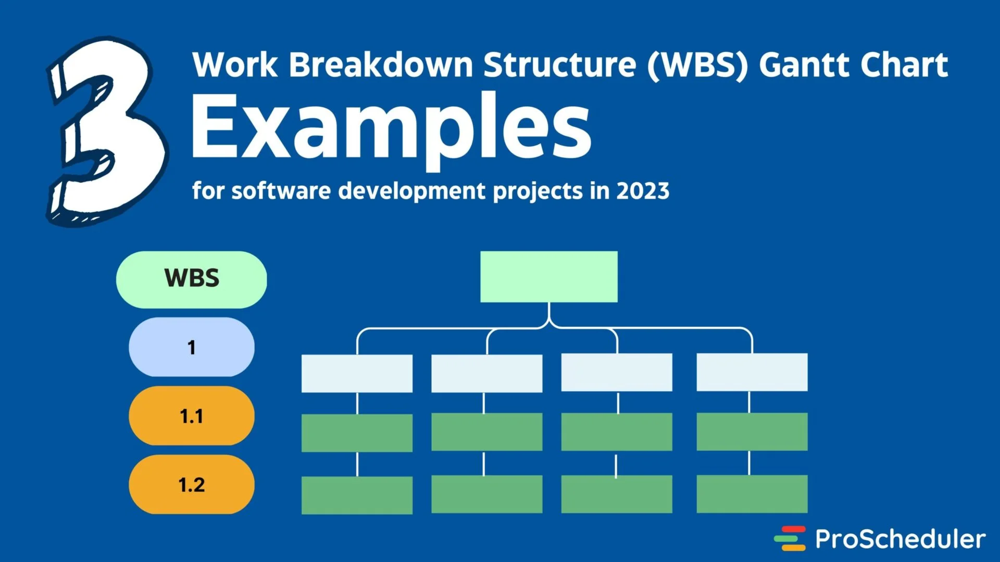
  - 
- **WBS vs Backlog**
  - WBS assumes that scope, time, and cost are fixed and works to control them.
  - WBS has more structure than a backlog in its design. The WBS has specific numbering conventions and design rules, including MECE and the 100% rule.

|                         | WBS               | Project Backlog             | Product Backlog              |
| :---------------------- | :---------------- | :-------------------------- | :--------------------------- |
| Duration                | Length of project | Length of project           | As long as product is viable |
| Scope                   | Fixed             | Flexible                    | Flexible                     |
| Resources               | Fixed             | Fixed                       | Fixed                        |
| Time                    | Fixed             | Fixed                       | Fixed                        |
| Deliverable or Activity | Deliverable       | Deliverable                 | Deliverable                  |
| Hierarchy               | Numbered Levels   | Epic > Feature > User Story | Epic > Feature > User Story  |
| When Created            | Planning Phase    | All Phases                  | Entire Life Cycle            |

- **WBS Dictionary, Work Package, Task**
  - Dictionary: itemized list with id number. Includes more information about item.
  - Work Package: one or more deliverables that need to be created together.
    - collectively develop deliverable.
  - Task: many little activities to create the project.
- **WBS MECE**
  - Mutually Exclusive: no overlaps. each label no repeated.
  - Collectively Exhaustive: Together, all work packages encompass the entire project.
- **WBS Rules**
  - can estimate cost, time, resources.
  - 8/80. Element should last at least 8hrs but no more than 80hrs.
  - will fit in reporting period(report on project status).
  - produces measurable deliverable.
  - breaking down further wouldn't help project.
