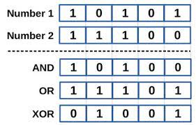
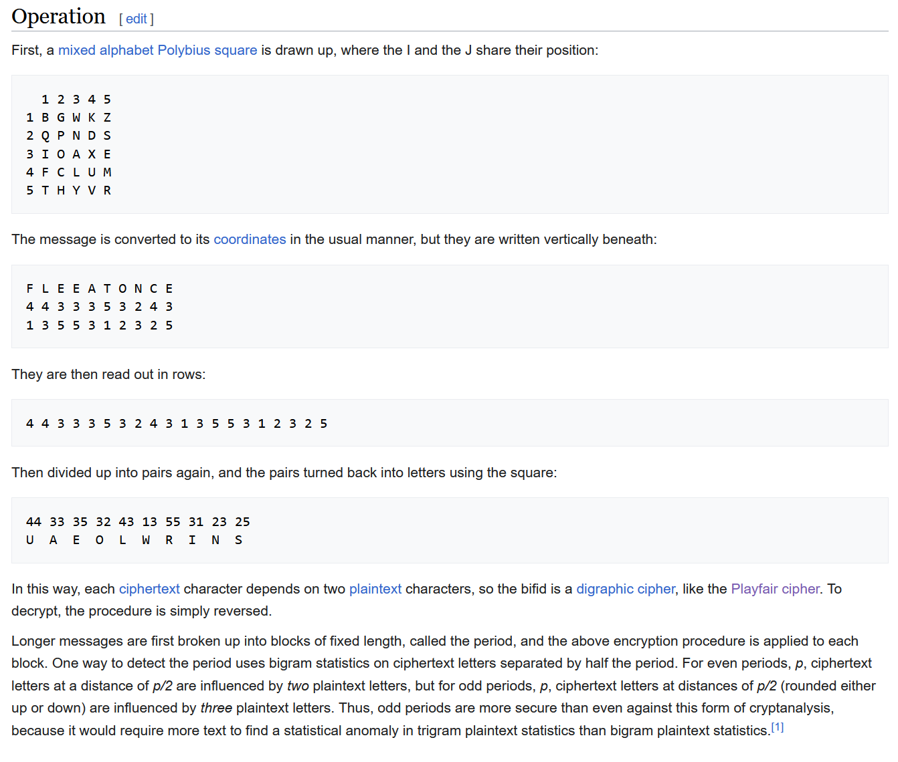
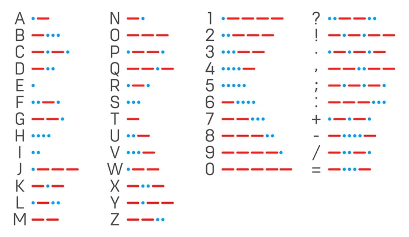
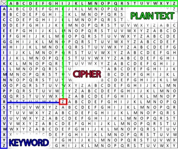

# Cryptography

## Tips

- https://www.reddit.com/r/WGU/comments/10q02wp/passed_introduction_to_cryptography_d334/
- https://quizlet.com/746560037/c839v5d334-additional-practice-flash-cards/
- https://quizlet.com/757601399/c839v5d334-algorithms-drill-flash-cards/
- https://drive.google.com/drive/folders/15muIPXETMkm8O4wR2ydhvJGXNF29v1C6
- https://studylib.net/doc/25995752/shawns-c839v5-d334-all-in-one-study-guide-1
- https://quizlet.com/Jose_Hernandez246/folders/108440218/sets
- https://www.youtube.com/playlist?list=PLCpo5JCOaimi8Ot328oQWGL73bT3O0ibc
- https://www.reddit.com/r/WGU/comments/11pvlg3/failed_introduction_to_cryptography_d334/
- https://www.studocu.com/en-us/document/western-governors-university/legal-issues-in-information-security/how-to-pass-c839-intro-to-cryptography-2994/36521132
- https://www.reddit.com/r/WGU/comments/v0szcv/thirdterm_bscc_c173_c916_c175_c839/
- https://www.reddit.com/r/WGU/comments/v9plvw/passed_c839d334_intro_to_cryptography/

## WGU Tips

Chapter 2 Summary
Webex meeting recording: Chapter 2 Summary
Recording link: https://wgu.webex.com/wgu/ldr.php?RCID=11ae0fc01ef3146e29f3def3c20cc295

Chapter 3 Summary
Webex meeting recording: Chapter 3 Summary
Recording link: https://wgu.webex.com/wgu/ldr.php?RCID=5585101366429fd1c6ebdfbb8774af88

Chapter 4 Summary
Webex meeting recording: Chapter 4 Summary
Recording link: https://wgu.webex.com/wgu/ldr.php?RCID=66510775337a1d7dd17606335f86f15b

Chapter 5 Summary
Webex meeting recording: Chapter 5 Summary
Recording link: https://wgu.webex.com/wgu/ldr.php?RCID=881e20011a4e41e2fbc6098ec52a1bd2

Chapter 6 Summary
Webex meeting recording: Chapter 6 Summary
Recording link: https://wgu.webex.com/wgu/ldr.php?RCID=7d211a50d793869dfda4c34b900e8efb

Chapter 7 Summary
Webex meeting recording: Chapter 7 Summary
Recording link: https://wgu.webex.com/wgu/ldr.php?RCID=96771c992d911855f55fbc96487ef478

Chapter 8 Summary
Webex meeting recording: Chapter 8 Summary
Recording link: https://wgu.webex.com/wgu/ldr.php?RCID=86e2b75e058eaa3207a1efc71fbc2a71

Chapter 9 Summary
Webex meeting recording: Chapter 9 Summary
Recording link: https://wgu.webex.com/wgu/ldr.php?RCID=755d2552b1c36fe8f051b9b91e84ca05

Chapter 10 Summary
Webex meeting Recording: Chapter 10 Summary
Recording link: https://wgu.webex.com/wgu/ldr.php?RCID=204455271930ab7c9280faed0e9e516d

Chapter 12 Summary
Webex meeting recording: Chapter 12 Summary
Recording link: https://wgu.webex.com/wgu/ldr.php?RCID=d14aead54d8192afa00690e026ae5276

Topic covered was PKIs
Recording link: https://wgu.webex.com/wgu/ldr.php?RCID=4951ceffe4b5807a18eb82607ee842c0

Topic covered was Cipher Modes
Recording link: https://wgu.webex.com/wgu/ldr.php?RCID=aeb7d2d305685b241c488b601ed1f4bd

## Exam Preparedness

To prepare for the objective assessment, ask yourself these questions:

## Section 1

- **Binary AND, OR, XOR**:
  - 
  - **AND** both must be true. '1'.
  - **OR** only one needs to be true. '1'.
  - **XOR** only a true and false = '1'.;
- **Authentication**: It is the process of verification of the identity of the person.;
- **Encryption**:
  - simplest terms, changing plaintext into ciphertext.
  - encryption should be done at rest and in transit.;
- **Decryption**: changing ciphertext into plaintext.;
- **Authorization**: It refers to the process of granting or denying access to a network resource or service. Most of the computer security systems that we have today are based on a two-step mechanism. The first step is authentication, and the second step is authorization or access control, which allows the user to access various resources based on the user’s identity.;
- **Confidentiality or privacy**: It means the assurance that only authorized users can read or use confidential information. When cryptographic keys are used on plaintext to create ciphertext, privacy is assigned to the information.;
- **Integrity**: Integrity is the security aspect that confirms that the original contents of information have not been altered or corrupted. There should be not any kind of modification with information while its transport over the network.;
- **Non-repudiation**: Non-repudiation makes sure that each party is liable for its sent message. Prevents someone from communicating and then denying it occurred, occurred at a different time, or even deny receiving any piece of information.;
- **Monoalphabetic Cipher**: code or substitution is where a single mapping from our alphabet to a cipher alphabet is created. Many early cryptosystems used this.;
- **Polyalphabetic Cipher**:
  - refers to the mapping of our alphabet to a number of cipher alphabets. This approach added a bit of complexity to early cryptosystems.
  - In a polyalphabetic cipher, each letter can be replaced by multiple ciphertext letters based on its position within the plaintext. The Vigenère cipher is an example of a polyalphabetic cipher.;
- **Pigpen Cipher**:
  - 
  - Mono-alphabetic substitution cipher that makes use of mapping plaintext characters to graphical characters rather than to alphabetic. ones. i.e. A=(pick a symbol), vs A=(pick a letter). Disadvantage -once the mapping is known, it is difficult to keep the message secret.;
- **Rail Code Cipher**:
  - 
  - Employs a method to scramble text by writing it in a sequence across a number of rails.;
- **BIFID Cipher**:
  - 
  - Makes use of a grid and which maps the letters into numeric values.;
- **Playfair Cipher**:
  - 
  - The Playfair cipher uses a 5×5 grid of letters, and encrypts a message by breaking the text into pairs of letters and swapping them according to their positions in a rectangle within that grid "HI" becomes "BM".;
- **Morse Code Cipher**:
  - 
  - Encoding method, rather than a cipher, that works by translating characters into sequences of dots (.) and dashes (-).;
- **Caesar Cipher**:
  - 
  - Mono-alphabetic substitution cipher known as "shift" cipher. Involves plaintext being replaced by a letter some fixed number of positions down the alphabet. i.e., a Caesar Cipher using a shift of +3 would mean a plaintext letter A would result in a ciphertext letter D (a shift of three positions to the right in the alphabet).;
- **Vigenere Cipher**:
  - 
  - Polyalphabetic cipher that involves using a different mapping, based on a keyword, for each character of the cipher. An advantage of this type of cipher is that the same plaintext character is likely to be coded to different mappings, depending on the position of the keyword, making guessing more difficult.;
- **One Time Pad Cipher**:
  - 
  - Cipher code mapping that is used only once. Advantage is it is essentially unbreakable, disadvantage is it takes lots of work as you'd have to generate the pad to be used, each time.;
- **Four-square Cipher**:
  - 
  - Uses four 5 × 5 matrices arranged in a square, are where each matrix contains 25 letters for encoding and decoding operations.;
- **Enigma Machine**: Used a polyalphabetic substitution cipher, which did not repeat within a reasonable time period, along with a secret key. For the cracking of the Enigma cipher, the challenge was thus to determine both the algorithm used and the key. Enigma’s main weakness, though, was that none of the plain text letters could be ciphered as itself.;
- **Digital Signatures**: Authentication and Non-repudiation.
  1. Sender encrypts hash of media with private key.
  2. Receiver decrypts signature with senders public key and compares hash of media with decrypted hash of signature
  3. If both match, only the sender could sign media and media integrity is assured.;
- **Pseudo-Random Number Generators (PRNGs)**: This method repeats the random numbers after a given time (periodic). They are fast and are also deterministic and are useful in producing a repeatable set of random numbers.;
- **True Random Number Generators (TRNGs)**:
  - This method generates a true random number and uses some form of random process. One approach is to monitor the movements of a mouse pointer on a screen or from the pauses between keystrokes.
  - Overall, the method is generally slow, especially if it involves human interaction, but is **non-deterministic** and **aperiodic**.;
- **Frequency Analysis**: cipher cracking methodology that involves identifying patterns and **variations in the probability** of codes.
  - example. a three-letter ciphered text combination spotted at the beginning of a string too often could tip us off that those three letters correlate the letters THE in the English alphabet.;
- **Entropy**: measures level of unpredictability in encryption relates to the degree of uncertainty of the encryption process.
  - more entropy, harder to crack.;
- **Two common binary to character encoding methods**:
  1. ASCII (8-bit values, up to 256 characters)
  2. UTF-16 (16- bit values, up to 65,536 characters).;
- **Hardware vs Software encryption**: Hardware encryption is more efficient than software encryption.;
- **hardware security module (HSM)**: is a tamper-evident and intrusion-resistant physical device that safeguards and manages cryptographic keys and provides cryptographic processing.;
- **trusted platform module (TPM)**: is a dedicated processor that handles hardware-level encryption allows the use of full disk encryption on a hard drive in a manner that minimizes the impact on system performance. TPM contains the encryption keys.;

## Section 2

- **Secret-Key Encryption**: Symmetric encryption. One key (de/en)crypts.
  - Since the same key is used for both encryption and decryption in symmetric cryptography, a challenge that exists is finding a secure way to share or transport the key between the entity encrypting and the one decrypting.;
- **Public-Key Encryption**: Asymmetric encryption. Two keys. Public/Private. Only public key can decrypt private key. Only private key can decrypt public key. Authenticate Identities. Pass Secret-Keys.;
- **Diffie-Hellman**: fundamental cryptographic protocol used to establish a secure shared secret between two parties over an insecure communication channel.;
- **Symmetric Block Encryption**:
  - grouping data into blocks and encrypting the individual blocks.
  - padding is used to fill blocks to operating size when the data does not fit perfectly.
  - Symmetric block ciphers manage how blocks of data are processed through block cipher mode implementations. For instance, one may choose to use the DES block cipher configured with ECB as the mode of operation.
  - Common block cipher modes covered in this course include ECB, CBC, CFB, OFB, and CTR.
  - CTR can be run in parallel(do not rely on the previous block) and essentially allow the block cipher to operate like a stream cipher.;
- **Symmetric Stream Encryption**: much faster than block and can typically be applied in real-time applications. symmetric stream encryption involves encrypting one bit at a time, i.e., a synchronous stream.;
- **Work Factor**:
  - All current cipher codes are crackable and a measure of the security of a code is the amount of time it would take to break the code based on the computational power available. This is often referred to as the work factor. As processing power magnifies, security of current ciphers decreases.;
  - **Salting**: is the process of adding an initialization vector to the ciphering process to change its operation and ensure that the ciphertext does not give the original plaintext when played back.;
  - **Describe Block Cipher**:
    - 
    - Outline how the blocks will be handled depending on the implementation selected (i.e., which mode is used). Implementation selection can be based on anything just as type of cipher can. Factors can include security needs or not, processing capacity, organization preference and so on.;
- **Electronic Code Book Cipher (EBC)**:
  - 
  - ;
- **Cipher Block Chaining (CBC)**:
  - 
  - ;
- **Cipher Feedback (CFB)**:
  - 
  - ;
- **Output Feedback (OFB)**:
  - 
  - ;
- **Counter Mode Cipher**:
  - 
  - ;

## Section 3

- **Explain Hashing**:
  - describes one-way or irreversible encryption used for protecting the integrity of data and in authentication applications.
  - Hashing is normally used to either hide the original contents of a message (such as hiding a password), or to check the integrity of data.
  - Hashing involves taking a variable length input and producing a fixed length output (message digest).
  - A weakness of one-way hashing is that the same piece of plaintext will result in the same ciphertext (unless salt is applied).;
- **Hah Collision**: occurs when two different input values that produce the same hash signature. Different files produce the same hash value, rare but possible. Collision attacks exploit this.
  - Also called **Hash Similar Context**, **Pre-image attack**, and **Hash Full context**.;
- **Apache-defined APR1 Hash**: format that addresses the problems of brute forcing an **MD5** hash, and basically iterates the hash value 1,000 times.;
- **SHA method**: does not have a salted value. SHA produces a 160-bit signature, thus can contain a larger set of hashed value than MD5, but because there is no salt it can be open to rainbow table attacks, and also brute force. (A rainbow table is a collection of precomputed hash values of actual plaintext passwords used for password cracking.);
- **HMAC**: is a message authentication code (MAC) that can be used to verify the integrity and authentication of the message. It involves hashing the message with a secret key, and thus differs from standard hashing, which is purely a one-way function.;
- **Passwords which use a hashed value can be cracked by**: either with rainbow tables or brute force. An improved method of generating passcode is to generate a different one each time based on an initial seed value or based on time. One Time Passwords, Timed One Time Password, Hashed One Time Password.;
- **One Time Passwords (OTP)**: This allows a new unique password to be created for each instance, based on an initial seed.;
- **Timed One Time Password (TOTP)**: This allows for a new unique passcode to be created for each instance, based on an initial seed and for a given time period.;
- **Hashed One Time Password (HOTP)**: This allows a new unique passcode to be created each instance, based on a counter value and an initial seed.;
